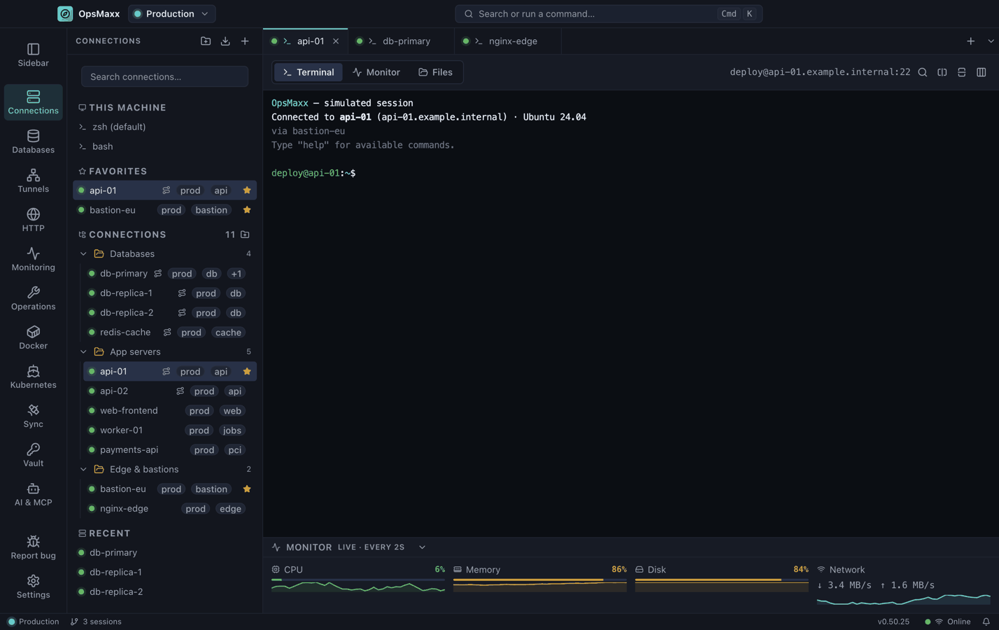

<div align="center">


# OpsMaxx

**A free, open-source SSH client, SFTP browser, database manager, secrets vault and secure AI-agent gateway — in one desktop app.**

Your DevOps workstation, everywhere. Windows · macOS · Linux.

**[opsmaxx.dev](https://opsmaxx.dev)**

<a href="https://github.com/OpsMaxx/OpsMaxx/releases/latest">

</a>

<a href="https://github.com/OpsMaxx/OpsMaxx/releases/latest"></a>
<a href="https://github.com/OpsMaxx/OpsMaxx/releases/latest"></a>
<a href="https://github.com/OpsMaxx/OpsMaxx/releases/latest"></a>

[](https://github.com/OpsMaxx/OpsMaxx/releases/latest)
[](https://github.com/OpsMaxx/OpsMaxx/releases)
[](https://github.com/OpsMaxx/OpsMaxx/stargazers)
[](LICENSE)

[Website](https://opsmaxx.dev) · [Install](docs/install.md) · [Features](docs/features.md) · [AI agents](docs/ai-agents.md) · [Workspaces](docs/workspaces.md) · [Terminal](docs/terminal.md) · [Databases](docs/databases.md) · [Tunnels](docs/tunnels.md) · [Vault](docs/vault.md) · [Security](docs/security.md) · [FAQ](docs/faq.md)

</div>

---

> [!IMPORTANT]
> **Windows will show a security warning the first time you run OpsMaxx.
> This is expected, and it is not a virus. macOS no longer warns.**
>
> From 0.30.1 the macOS build is **signed with an Apple Developer ID and notarized by
> Apple**, so it opens normally with no warning and no right-click-Open dance.
>
> The Windows build is still **unsigned** — a certificate there costs $200–$400 a year,
> which this project has no income to cover. That warning means Windows cannot confirm
> **who published** the app. It says nothing about whether the file is safe.
>
> Every release is scanned before it is published — **ClamAV** over every artifact,
> **Microsoft Defender** on the Windows installer, and **VirusTotal's 70+ engines** on the
> `.exe` and `.dmg` — and publishes a **SHA-256** for every file, so you can verify the
> download yourself.
> → [How to get past the warning, and the scan results](docs/install.md)

OpsMaxx is a **free and open-source alternative to MobaXterm, PuTTY, Termius, SecureCRT and MobaXterm Personal Edition**, built for engineers who spend the day moving between bastions, production boxes and databases — and increasingly, for the AI coding agents helping them do it. It combines an **SSH terminal**, **SFTP file browser**, **server monitoring**, **SSH tunnels**, a **multi-engine database client**, an **encrypted password vault** and a **secure [MCP](docs/ai-agents.md) bridge for Claude Code, Claude Desktop, Codex and other AI agents** in a single window — with no account, no telemetry and no subscription.

**What makes it different** isn't any one of those — MobaXterm, Termius and the rest each do some of this. It's that they're all in the same place, sharing the same credential store, and that credential store is now also what stands *between* an AI agent and your infrastructure, not something an agent ever has to be handed directly.



## Why OpsMaxx


Most terminal tools do one thing. A typical DevOps task needs four: open a shell through a jump host, tail a file, poke a database that is only reachable from inside the network, and look up a credential. OpsMaxx puts those in one place, keeps them organised per project, and stores every secret in your operating system's keychain rather than a plaintext config file.

- **No lock-in** — connections import from your existing `~/.ssh/config`
- **No account** — nothing is uploaded, nothing phones home
- **No cost** — MIT licensed, free forever, contributions welcome
- **No exposed credentials, even to AI** — Claude Code, Claude Desktop and Codex can run commands and read files through it, but never see a password, private key, IP or username — see [AI Agent Access](docs/ai-agents.md)


## What's in it

| | |
|---|---|
| **SSH terminal** | xterm with GPU rendering, split panes, search, and unlimited chained jump hosts per server |
| **Local terminal** | Your own zsh, bash, PowerShell, Git Bash, MSYS2 or WSL in a tab beside the SSH ones — and reachable by no AI agent |
| **SFTP browser** | Browse, edit, upload and delete over the same connection |
| **Remote desktop** | RDP to a Windows host, through a bastion when it needs one |
| **Monitoring** | Live CPU, memory, disk and network per server, a fleet wall, background checking and webhook alerts |
| **Tunnels & VPN** | Local, remote and SOCKS5 forwards; userspace WireGuard with no administrator rights; OpenVPN and frp |
| **Databases** | PostgreSQL, MySQL, SQL Server, MongoDB and Redis, direct or through a bastion |
| **Vault** | AES-256-GCM secrets store, with credentials in your OS keychain rather than a config file |
| **AI agent gateway** | Claude Code, Claude Desktop and Codex can work through it without ever seeing a password, key, IP or username |

→ **[The full feature list, what it replaces, and the work it was built for](docs/features.md)**

## Install

```bash
brew install --cask opsmaxx/tap/opsmaxx     # macOS
```

```bash
winget install OpsMaxx.OpsMaxx              # Windows
```

Or download an installer directly from the **[latest release](https://github.com/OpsMaxx/OpsMaxx/releases/latest)** — `.exe` for Windows, `.dmg` for macOS, `.AppImage`, `.deb` or `.rpm` for Linux.

→ **[Every install route, checksums, and the first-run warning](docs/install.md)**

## Quick start

1. **Add a server** — click **+** in the Connections sidebar, or press <kbd>Ctrl</kbd>+<kbd>N</kbd>. Authenticate with a password, a private key, an SSH agent or a certificate.
2. **Add jump hosts in the same dialog** — click **Add jump host**; hops connect in order, and each can borrow a saved server's credentials.
3. **Open a session** — click a server. Double-click for a second session in its own tab.

Already keep hosts in `~/.ssh/config`? Import them instead of retyping — `ProxyJump` comes across too.

→ **[The longer walkthrough, with screenshots](docs/install.md)**

## Documentation

| | |
|---|---|
| **[Features](docs/features.md)** | The full list, the comparison with MobaXterm, PuTTY, Termius and SecureCRT, and real-world use cases |
| **[Install](docs/install.md)** | Every route for Windows, macOS and Linux, plus the first-run security warning |
| **[AI agent access](docs/ai-agents.md)** | How MCP clients reach your infrastructure without seeing a credential |
| **[Workspaces](docs/workspaces.md)** | Keeping clients, environments and projects apart, and locking them |
| **[Terminal](docs/terminal.md)** | The terminal, the local shell, the command palette and every shortcut |
| **[Monitoring](docs/monitoring.md)** | Watching a fleet, and running one change across all of it |
| **[Databases](docs/databases.md)** | Five engines, direct or through a bastion |
| **[Tunnels and VPN](docs/tunnels.md)** | Forwards, SOCKS5, WireGuard, OpenVPN and frp |
| **[Vault and settings](docs/vault.md)** | The secrets store, backups, and the settings worth knowing |
| **[Security](docs/security.md)** | How credentials are stored and what is never written to disk |
| **[FAQ](docs/faq.md)** | The questions that come up most |

## Security


- Credentials are stored with **Electron `safeStorage`**, backed by DPAPI on Windows, Keychain on macOS and libsecret on Linux — never in plaintext
- The vault and backups use **AES-256-GCM** with **scrypt** key derivation
- Workspace passwords are stored as **scrypt verifiers** compared in constant time
- **Host keys are verified**: unknown servers prompt with a SHA-256 fingerprint, and a changed key is refused outright
- **Remote desktop certificates are pinned** the same way — RDP servers are self-signed by default, so a first sighting asks and a change is refused
- Shell input is **parsed, never evaluated** — no `eval` on anything you type
- The renderer runs with `contextIsolation` on and `nodeIntegration` off, behind a strict Content-Security-Policy

Found a vulnerability? Please read [SECURITY.md](SECURITY.md) — do not open a public issue.


## Contributing


Contributions are very welcome, whether that is code, documentation, a bug report or a translation. Start with [CONTRIBUTING.md](CONTRIBUTING.md) for the architecture overview and development workflow, and please follow our [Code of Conduct](CODE_OF_CONDUCT.md).

Good first issues are labelled [`good first issue`](https://github.com/OpsMaxx/OpsMaxx/labels/good%20first%20issue).


## Licence


OpsMaxx is released under the **[MIT Licence](LICENSE)** — free to use, copy, modify and share, for personal and commercial work alike, with no fee and no subscription.

**This tool is not sold.** It is given to the community. If someone is charging you for OpsMaxx itself, you are being overcharged — download it here for free. The MIT licence does permit others to redistribute or build commercial products on top of it; that is a deliberate part of being genuinely open source, and it is what lets companies adopt it without a legal review.

Please do keep the copyright notice, and do not imply the maintainers endorse a fork.

---

<div align="center">

**Built for the DevOps community.** If OpsMaxx saves you time, a ⭐ helps others find it.

[⬇ Download OpsMaxx](https://github.com/OpsMaxx/OpsMaxx/releases/latest) · [🐞 Report a bug](https://github.com/OpsMaxx/OpsMaxx/issues/new/choose) · [📧 Contact](mailto:aliwaqarofficial@gmail.com)

*Keywords: open source SSH client, free SSH client for Windows, free MobaXterm alternative, PuTTY alternative, Termius alternative, SecureCRT alternative, Xshell alternative, MobaXterm for Mac, SSH client for macOS, SSH client for Linux, SSH terminal manager, SSH connection manager, SFTP client, SCP file transfer, SSH tunnel manager, port forwarding tool, SOCKS5 proxy client, bastion host client, jump host SSH client, ProxyJump GUI, ssh config importer, server monitoring tool, database GUI client, PostgreSQL client, MySQL client, MongoDB client, Redis client, SQL Server client, database over SSH tunnel, password manager for developers, encrypted secrets vault, AES-256-GCM vault, DevOps tools, sysadmin tools, self-hosted, no telemetry, no subscription, Electron SSH client, cross-platform terminal, Windows macOS Linux, MCP server, Model Context Protocol, AI agent SSH access, Claude Code MCP integration, Claude Desktop MCP server, Codex MCP server, Gemini CLI MCP, AI DevOps tool, secure AI infrastructure access, AI agent access control, credential-free AI automation, human-in-the-loop AI approvals, AI audit log.*

</div>
