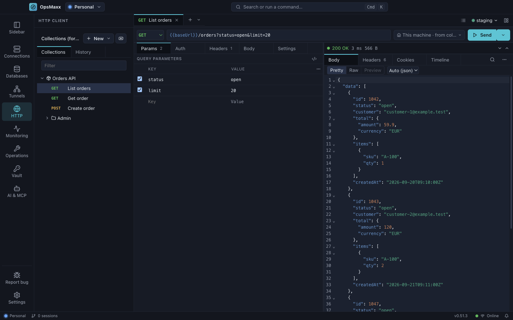
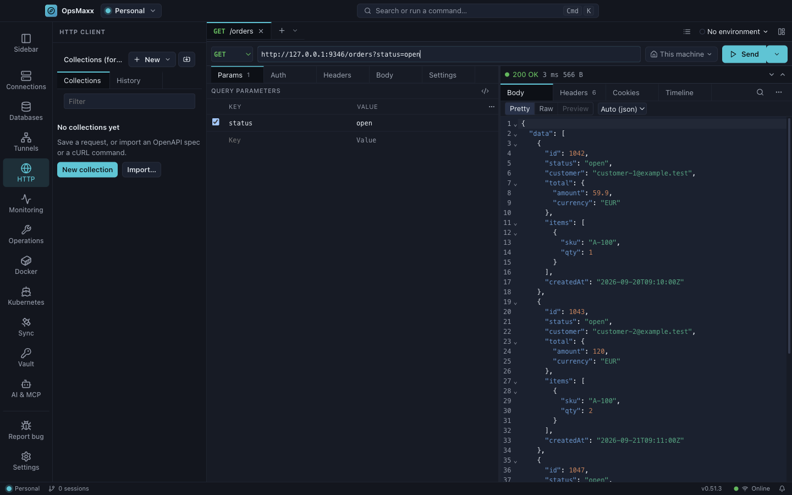

---
docgov:
  id: http-client
  type: user.guide
  authority: audience
  audience:
    - users
  visibility: public
  status: active
  generation:
    mode: human-maintained
---
# HTTP client

Send REST, WebSocket and GraphQL requests from inside OpsMaxx, over the same routes your terminals use.

## Goal

The HTTP client is an API client with one difference that matters: **a request leaves from wherever you choose**. That can be this machine, one of your saved servers (over its SSH connection), or a VPN profile. So `http://localhost:8080` sent through `web-01` reaches the service on web-01's loopback, and `gitlab.internal` resolves inside that server's network. Nothing is exposed, and no tunnel has to be opened by hand.

Requests are sent by OpsMaxx's main process, not by the window. That means:
- there are no CORS rules;
- a private certificate authority can be trusted for one collection, with verification still on;
- WebSocket handshakes can carry real headers such as `Authorization`.

By the end of this guide you can send a request, save it, run it against dev and production environments, and import what you already have.

## Steps

### 1. Send your first request

1. Open **HTTP** in the activity bar. With no tab open, the workbench shows an empty URL row, ready to type into.
2. Paste a URL, or a whole `curl …` command, and press **⌘↵** (Windows/Linux: **Ctrl+Enter**).
   A pasted command becomes the request: method, headers and body are filled in, and a toast lists anything that was left out (see step 7).
3. The response appears beside the request, or below it when the window is narrow.

A URL typed without a scheme gets one:
- `http://` for `localhost`, loopback, `10.x`, `172.16–31.x`, `192.168.x`, single-label hosts and `*.internal`;
- `https://` for anything else.

### 2. Build a REST request

- **Method and URL.** Query parameters stay in step with the URL both ways. A disabled row stays in the table but is left out of the URL. `:id` and `{id}` segments are listed under **Path parameters**.
- **Variables.** Write `{{name}}` anywhere. Hover a token, or press **⌘I** (Ctrl+I) with the caret in it, to see its value and where it comes from. If a token cannot be resolved, OpsMaxx stops before sending and names it. Add it, or choose **Send anyway** (offered unless the token is in the host part of the URL).
- **Auth.** The types are Inherit from collection, No auth, Bearer token, Basic, and API key (header or query).
  - A secret typed as plain text is sent but **not saved**. The field says "Not saved — kept for this session only" and offers **Move to vault…**, which creates or unlocks the [vault](../../vault.md) if needed and replaces the text with a `vault:` reference.
  - References resolve at send time: in headers, the URL, auth fields and form rows. They **never** resolve inside a JSON, XML or text body, because a server can echo a body back.
- **Headers.** OpsMaxx sets some headers itself. Turn on **Auto-generated headers** in the Layout menu to see them, each with the reason it is there.
  - `User-Agent`, `Content-Type`, `Authorization` and `Cookie`: a row of your own replaces each one.
  - `Content-Length` and `Host`: set by the connection, and cannot be overridden.
- **Body.** The modes are None, JSON, Text, XML, Form URL-encoded, Multipart (a text or file field per row) and Binary file.
  - Files are held in memory only. After a restart the request shows **Choose the file again**.
  - A body over 256 KiB is sent, but not saved.
- **Settings.**
  - **Timeout:** the collection's default, else 30 s, capped at 10 min.
  - **Follow redirects:** on. **Max redirects:** 5. A redirect to a different host drops your credentials, the route and any certificate exceptions, and a 307 or 308 that would re-send the body to another host is refused with a reason.

**Reading the response.**
- **Body** has three views: Pretty, Raw and Preview (for HTML and images). Preview is offline: scripts and remote resources are blocked, and SVG is shown as an image.
- **Headers**, **Cookies** and **Timeline** are the other tabs. Timeline shows what was actually sent, with credentials masked.
- Right-click the body for:
  - Find (**⌘F**), Wrap lines, and Fold all / Unfold all;
  - **Copy value** and **Set as variable…**, which act on the JSON value under the caret. When the value looks like a credential (a token, or a name such as `access_token`), the dialog warns that a variable is saved and synced as plain text and offers **Store in vault…**;
  - **Copy response** and **Save response to file…**. Saving starts in your Downloads folder and writes the bytes unchanged.

**Cookies** from responses go into a jar that lives until you quit OpsMaxx. The jar is kept per workspace **and per route**, because `localhost` through `web-01` is not the same machine as `localhost` here. A `Secure` cookie is never sent over `http://`. **Layout ▸ Cookies…** shows the jar and clears it.

### 3. WebSocket

**+ New ▸ New WebSocket**, then **⌘↵** (Ctrl+Enter) to connect.
- Handshake headers and subprotocols come from the request.
- Once connected, **⌘↵** sends the composer's message as Text or JSON. **⌥⌘B** (Ctrl+Alt+B) beautifies it. **⌘↵** never disconnects.
- The log keeps the last 5,000 frames per tab, and you can search and filter it.
- Right-click a frame to copy it, load it into the composer, resend it or save it.

### 4. GraphQL

**+ New ▸ New GraphQL request.** The request has Query, Auth, Headers and Settings tabs.
- The first successful **Run** loads the schema, over the same route; **Load schema** in the Schema explorer does it on demand. From then on the query editor autocompletes fields and arguments, and the explorer lets you browse types.
- Variables are JSON, in the collapsible Variables pane under the query.
- **Prettify** (**⌥⌘B** / Ctrl+Alt+B) formats the query.
- When a document holds several operations, **Run** offers each one by name. A mutation sent to production asks first (step 5).

### 5. Save, organise and switch environments

- **Saving.** **⌘S** (Ctrl+S) saves a request into a collection. A collection holds folders and requests, and has its own variables, default auth and connection settings.
  - **A saved request is sent from its collection's route.** The save dialog says so when that differs from the route the request used.
  - In the tree, **F2** renames, **Delete** (macOS **⌘⌫**) deletes, and **⌘Z** (Ctrl+Z) undoes the last delete.
- **Environments** hold variables for each environment. **⌘E** (Ctrl+E) opens the picker. The narrowest scope wins: environment, then collection, then globals.
  - Tick **Production** on an environment. It is pre-ticked when the name contains `prod` or `production`.
  - A production target shows a red rule on the URL row and a `PROD` badge.
- **The production confirm.** OpsMaxx asks "Send … to production (…)?" before any of these go to a production target:
  - a POST, PUT, PATCH or DELETE;
  - a GraphQL mutation;
  - a WebSocket connect or message.

  A production target is a production environment, or a route through a server tagged `prod` or `production`. The confirm covers every way of sending: the button, **⌘↵**, the palette and history. "Don't ask again this session" applies only to that environment or server, and that action.
- **History** lists what you sent, grouped by day and searchable. **Send again** and **Open as new request** keep the original route. If that server or VPN profile has been deleted, the request is refused, never sent from this machine instead.
  - Send again on a request that is still saved sends the saved request as it is now.
  - Otherwise the request is rebuilt from history, where credential-named values were masked. Those fields are marked "Not kept", and the request will not send until you enter them again.

### 6. Choose where requests leave from, and how certificates are checked

- **Send from** is the route chip on the URL row: This machine, a saved server, or a VPN profile.
  - A new, unsaved request owns its route.
  - A saved request uses its collection's route. Change it from the chip, or in **Collection ▸ Connection**.
- **Certificates** are verified unless you change that, per collection, in **Collection ▸ Connection**.
  - **Verify certificates.** Turning it off asks you to confirm, and a red **TLS unverified** chip then stays on every request in that collection.
  - **Custom CA.** Choose a PEM file, or paste one. Only `-----BEGIN CERTIFICATE-----` blocks are kept, and a file containing a private key is refused. Trusting a CA also asks you to confirm.
  - A request that is not in a collection always verifies.
  - If another synced device turns verification off or changes the CA, the collection shows a one-time notice asking you to review it.

### 7. Import, and copy as cURL

**Import** is in the sidebar header, or press **⌘O** (Ctrl+O).
- **cURL.** Paste a command, check the preview, then **Open in new tab** or save it to a collection. Nothing in the command is run.
  - `$(…)`, backticks and `$VAR` are kept exactly as written.
  - These flags are **never honoured**, only reported:
    - file references (`-d @file`, `-F f=@file`, `-T`, `-K` and the like): only the file's name is kept, and you choose the file again;
    - `-k` / `--insecure`: certificates are still checked;
    - proxy flags: use **Send from** instead;
    - `--cacert`, `--cert`, `--key`;
    - `--location-trusted`, `--resolve`, `--connect-to`, `--unix-socket`, `--interface`.
- **OpenAPI** (JSON or YAML; Swagger 2 is upgraded). Fetch it from a URL over a route you choose, or pick a file.
  - Tags become folders, and `servers[0]` becomes the collection's `baseUrl`.
  - Only references inside the document are followed. References to other files or URLs are counted as "N external references not followed", and are never fetched or read.
  - **Re-import** replaces a collection's requests, after you confirm.
- **Generate code:** the code button in the request's toolbar opens a drawer with the request as cURL, fetch, Python (requests), Go or HTTPie. It is masked the same way as Copy as cURL, and **Include secrets…** asks first.
- **Copy as cURL:** **⇧⌘C** (Ctrl+Shift+C), from the Send menu, or from a tree row.
  - It **masks credentials by default**. Vault values, credential-named headers, query values and form fields, and URL passwords become `{{name}}` or `<secret>`.
  - **Copy as cURL (with secrets)…** asks first.
  - Every argument is single-quoted, so the command is safe to paste into a shell.

### 8. Lay it out, and learn the keys

The **Layout** menu (at the right of the tab strip) offers:
- orientation: Auto, Side by side or Stacked;
- show or hide the sidebar, the request pane and the response pane;
- the description column and auto-generated headers;
- the GraphQL Variables and Schema explorer panes;
- Cookies…, and Reset pane sizes.

| Action | macOS | Windows / Linux |
|---|---|---|
| Send / Connect / Run | ⌘↵ | Ctrl+Enter |
| Cancel the request in flight | Esc | Esc |
| New request tab | ⌘T | Ctrl+T |
| Close tab | ⌘W | Ctrl+W |
| Go to tab 1–8 / last | ⌘1–⌘8 / ⌘9 | Ctrl+1–Ctrl+8 / Ctrl+9 |
| Next / previous tab | ⌃Tab / ⌃⇧Tab | Ctrl+Tab / Ctrl+Shift+Tab |
| Reopen closed tab | ⌘⇧Z | Ctrl+Shift+Z |
| Duplicate tab | ⌘⇧D | Ctrl+Shift+D |
| Save / Save as | ⌘S / ⌘⇧S | Ctrl+S / Ctrl+Shift+S |
| Focus the URL | F6 | Ctrl+L |
| Next / previous region | F6 / ⇧F6 | F6 / Shift+F6 |
| Environment picker | ⌘E | Ctrl+E |
| Show or hide the response | ⌘J | Ctrl+J |
| Show or hide the request | ⌘⇧J | Ctrl+Shift+J |
| Side by side ↔ stacked | ⌥⌘J | Ctrl+Alt+J |
| Copy as cURL (masked) | ⇧⌘C | Ctrl+Shift+C |
| Import | ⌘O | Ctrl+O |
| Show variable | ⌘I | Ctrl+I |
| Find in an editor | ⌘F | Ctrl+F |
| Beautify a WebSocket message or GraphQL query | ⌥⌘B | Ctrl+Alt+B |
| Toggle sidebar | ⌘B | Ctrl+B |
| Tree: rename / delete / undo delete | F2 / ⌘⌫ / ⌘Z | F2 / Delete / Ctrl+Z |

- On Windows and Linux, Ctrl+1–9 pick request tabs in the HTTP client, not workspaces.
- On macOS, an HTTP shortcut shown with ⌘ needs ⌘, so ⌃E in a text field keeps its usual meaning.
- Rebind any of them in **Settings ▸ Keyboard Shortcuts**.

### 9. Know what is stored where

| What | Where | Synced / backed up |
|---|---|---|
| Collections, folders and requests, with their variables, auth, route and certificate settings | the app's data file | synced (if you use sync) and backed up |
| Environments and globals | the app's data file | synced and backed up |
| Open tabs and unsaved drafts | the app's data file | in backups (encrypted with the backup's passphrase, typed credentials already stripped), never synced |
| Request history | its own file on this device | **never** synced or backed up |
| Responses, cookies, WebSocket logs, GraphQL schemas, chosen files | memory | gone when you quit |

- **Typed credentials are not kept.** Before anything is saved or synced, OpsMaxx removes these, unless they are `{{variables}}` or vault references:
  - auth secret fields;
  - `Authorization`, `Proxy-Authorization` and `Cookie` header values;
  - URL passwords.

  Other values that look like credentials, such as an `X-Api-Key` header or a variable holding a token, are saved as written, with a warning that offers **Move to vault…**.
- **History:**
  - is sealed with your operating system's keyring. On a machine with no keyring (some Linux desktops) it is kept for the session only, and the History pane says so;
  - keeps 30 days or 2,000 entries, whichever runs out first;
  - holds the request with credential-named values masked, plus the response's status, size and timing;
  - never holds response bodies, cookies or WebSocket frames.

  **Clear history** removes the file, and so does **Delete all data**.

### 10. Upgrade from OpsMaxx 0.51.x

The old client's collections and environments are converted the first time the new client opens, and a banner reports what moved.
- A collection built from an OpenAPI description may need **Re-import**. For a file, choose the same file again: only its name was kept.
- Old cookies are cleared.
- Anything that could not be converted is kept aside rather than dropped, and the banner says how many.
- Credentials typed into the old Auth panel were never saved. Re-enter them, ideally as vault references.
- **Recover old data…** runs the conversion again from a copy of the old data. It adds collections and never overwrites existing ones.

## Verification

- A request sent through a server shows "via" that server on the response's status row, and in **Timeline**.
- **Timeline** and **Copy as cURL** show `{{name}}` or `<secret>`, never a vault value.
- After a restart, an auth field you typed as plain text reads "Not saved — kept for this session only".

If something goes wrong:
- **Certificate errors:** add the server's CA in **Collection ▸ Connection** rather than turning verification off.
- **"This port does not speak TLS":** the URL says `https://` but the service speaks plain HTTP. Retry with `http://`.
- **Route missing:** the server or VPN profile was deleted. Choose another in **Send from**.
- **Vault locked:** unlock it from the prompt, then send again.
- **Unresolved variable:** add it to the environment, the collection or globals from the variable card.

## Related

- [Vault](../../vault.md): where secrets referenced by `vault:` are kept.
- [Tunnels](../../tunnels.md) and [VPN](../../VPN.md): the other ways traffic reaches private networks.
- [Security](../../security.md)
- [Features](../../features.md)
