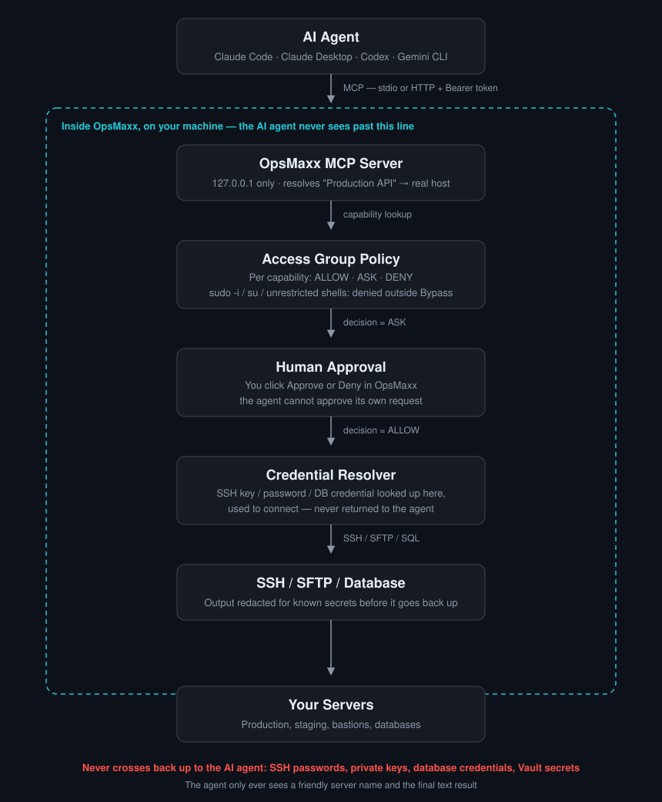
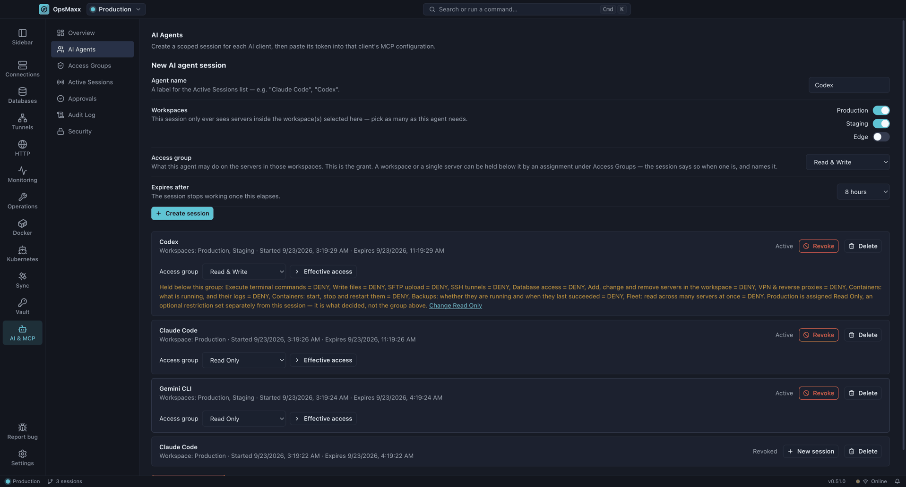
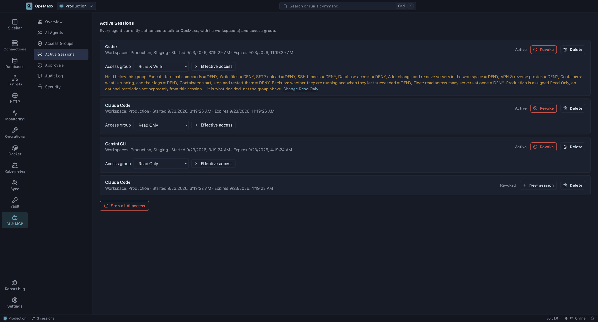
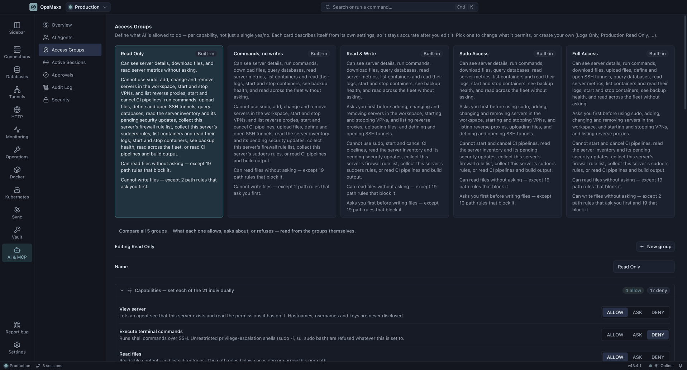
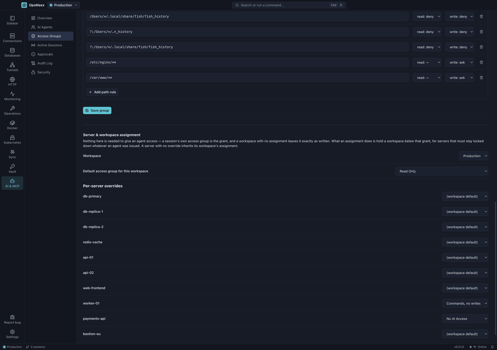
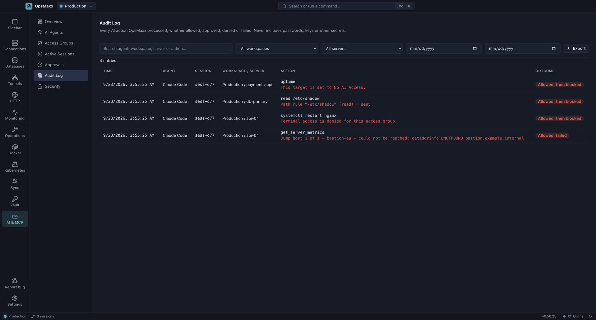
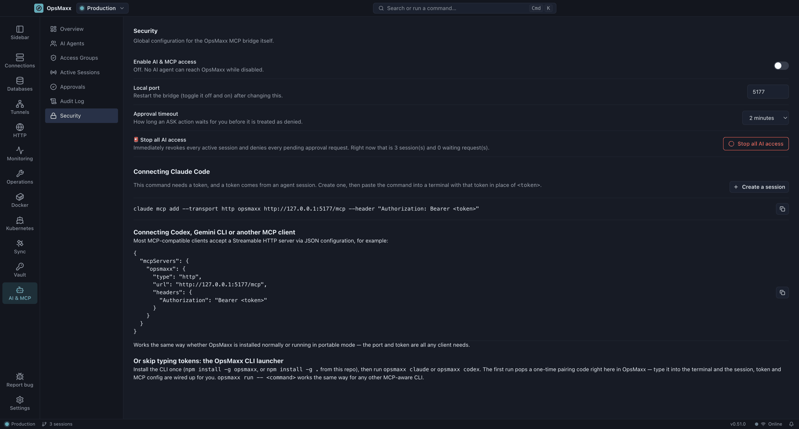

# AI & MCP — technical guide

This is the detailed reference for OpsMaxx's [MCP](https://modelcontextprotocol.io) bridge —
how it's built, what each screen does, and how to connect Claude Code, Claude Desktop, Codex or
another MCP client. For the short pitch and the security summary, see the
[README's AI Agent Access section](ai-agents.md). For the threat model, see
[AI-SECURITY.md](AI-SECURITY.md).

## Contents

- [Architecture](#architecture)
- [The MCP server](#the-mcp-server)
- [Sessions](#sessions)
- [Workspaces](#workspaces)
- [Access Groups](#access-groups)
- [Approvals](#approvals)
- [Audit Log](#audit-log)
- [Credential isolation](#credential-isolation)
- [The `opsmaxx` CLI and pairing](#the-opsmaxx-cli-and-pairing)
- [Connecting Claude Code](#connecting-claude-code)
- [Connecting Codex, Gemini CLI and other HTTP clients](#connecting-codex-gemini-cli-and-other-http-clients)
- [Connecting Claude Desktop](#connecting-claude-desktop)
- [Troubleshooting](#troubleshooting)

## Architecture



1. An MCP client (Claude Code, Claude Desktop, Codex, Gemini CLI, ...) sends a tool call over
   MCP — either **stdio** (via the `opsmaxx` CLI's `bridge` subcommand) or **Streamable HTTP**
   with an `Authorization: Bearer <token>` header, directly to OpsMaxx.
2. OpsMaxx's MCP server (`src/main/services/mcpServer.ts`) is an HTTP server bound to
   **`127.0.0.1` only** (`startMcpServer`, `mcpServer.ts`). Nothing outside the machine can reach
   it, regardless of firewall or network configuration.
3. Every tool call authenticates the bearer token against a session (`mcpAuth.ts`), then resolves
   the target server **by friendly name** (`serverResolver.ts`) — never by hostname, IP or username,
   because the tool call never carries one.
4. The **access group** governing that server/workspace is evaluated for the specific capability
   the tool needs (`policyEngine.ts`), producing `allow`, `ask` or `deny`.
5. `ask` blocks on a human decision (`approvals.ts`) before anything happens. `deny` returns an
   error immediately. `allow` proceeds.
6. Only at this point does OpsMaxx resolve the server's actual SSH/database credential
   (`credentialResolver.ts`) and open the connection — using the exact same connection-pooling
   path (`ssh.ts`) an interactive terminal session uses.
7. Command/file output is redacted (`secretRedaction.ts`) before it is returned to the agent, and
   the whole exchange is written to the audit log (`auditLog.ts`).

## The MCP server

`src/main/services/mcpServer.ts` registers **36 tools** — 28 core, plus the 8-tool CI/CD set at
the end of the table. `tests/localTerminalNotExposed.test.ts` holds the same 36 as a reviewed
whitelist, so a new tool cannot appear on the bridge without a diff somebody reads.

| Tool | Capability gating it | What it returns |
|---|---|---|
| `list_workspaces` | — | The workspace(s) this session is scoped to |
| `list_servers` | `viewServer` | Friendly names only, filtered to what the session can see |
| `get_server_details` | `viewServer` | Name, OS, access group, effective ALLOW/ASK/DENY per capability — **never hostname/IP/username** |
| `execute_command` | `terminal` (+ `sudo` if the command is sudo/doas, + file path rules for any absolute path it names) | stdout/stderr/exit code, redacted |
| `read_file` | `readFiles` + `sftpDownload` (+ file path rules) | File contents, redacted |
| `write_file` | `writeFiles` + `sftpUpload` (+ file path rules) | Bytes written |
| `list_files` | `readFiles` + `sftpDownload` (+ file path rules) | Directory listing |
| `get_capacity_trends` | `serverMetrics` | Where CPU, memory, disk and inodes are heading, from history already stored — it opens no connection and answers for an offline server. Answers with a **sentence per metric**, not the samples behind them: a rate, a crossing date or the named rule that refused, and always the window it was drawn from plus how much of that window was actually sampled. Disk is measured in bytes, because the stored percentage is df's rounded integer and too coarse to forecast |
| `get_server_metrics` | `serverMetrics` | CPU/memory/disk/uptime — and every failed systemd unit and listening port with its owning process, which is a service and port inventory as much as a capacity read |
| `get_host_facts` | `hostFacts` | Distribution, architecture, CPU model, virtualisation, package manager, pending updates and how many are security updates, and whether a reboot is owed. Its own capability rather than a widening of metrics, because it is a patch-status report. It never refreshes a package cache. A count reported as NOT AVAILABLE is not zero |
| `list_databases` | `viewServer` | Friendly names and engines, never a hostname or credential |
| `query_database` | `databaseAccess` for reads; `+ writeFiles` and always ASK for anything that writes | Rows, capped |
| `list_tunnels` | `sshTunnel` | Configured tunnels and whether each is running |
| `set_tunnel` | `sshTunnel`, always ASK to start | Confirmation, with the bound port |
| `create_tunnel` | `sshTunnel`, **always ASK**, **never cached** | A saved tunnel — **not a running one**. Starting it is `set_tunnel` and a second approval. A `remote` forward binding a non-loopback address is graded higher, and the prompt says it publishes that port on the server's network |
| `delete_tunnel` | `sshTunnel`, **always ASK**, **never cached** | That the tunnel is gone; it is stopped first if running |
| `list_vpns` | `vpnControl` | Names, engine, mode and state — **never an endpoint, key or listener address** |
| `set_vpn` | `vpnControl`, always ASK to start; **frp refused outright** | Confirmation, with a listener count |
| `add_server` | `manageServers`, resolved on the **workspace**, **never cached** | The name the new connection was saved under. `jumpHosts` names existing servers to reach it through, so a bastion-only host can be onboarded without disclosing one; `verify: true` dials it once and reports whether it came up rather than reporting a dead entry as added |
| `update_server` | `manageServers`, **always ASK even on ALLOW**, **never cached** | Which fields changed. Only what you pass is touched — a port change does not disturb the stored credential |
| `remove_server` | `manageServers`, **always ASK even on ALLOW**, **never cached** | That the connection and its stored credential are gone. The approval names what the removal takes with it when the server is another server's jump host |
| `test_connection` | `viewServer` | Whether the connection came up, and the *category* of failure if not — never a hostname, port or username, and never the driver's own text, which contains the address |
| `list_containers` | `containers` | Containers on one server: image, state, the runtime's own status line, published ports and compose project. It says when it fell back to root, and distinguishes "not in a project" from "the runtime could not say" |
| `container_logs` | `containers`, weighed higher at the prompt than the list | The last lines a container wrote. **It never follows** — a stream would outlive the approval that authorised it, and the stop-all-AI-access switch works by resolving requests still pending |
| `fleet_inventory` | `fleetRead`, resolved on the **workspace** | One row per server from what the sampler already collected, each stamped with when. Drift is deliberately absent from it |
| `container_action` | `containerControl`, graded **high** at the prompt | **The one tool on the bridge that changes the state of a running service.** Starts, stops or restarts exactly one container per call — there is no shape in which one approval acts on a host's worth of them. Starting is graded no lower than stopping: an agent starting a container begins serving traffic nobody asked for |
| `backup_status` | `backupRead`, resolved on the **workspace** | Every backup destination and how late each is against its own schedule. Destinations and kinds, never their credentials. It cannot run a backup or restore one at any setting |
| `describe_capabilities` | — **the one tool that is not gated** | What this session may do on a server, with the sentence the user was shown when they granted it, plus what is absent by design. Gating "what am I allowed to do" is how an agent discovers the boundary by tripping over it |
| `list_alerts` | `fleetRead`, resolved on the **workspace** | Alerts already raised, newest first. It says what *happened*; it does not rank hosts by exposure |
| `compose_status` | `containers` | The same container read, grouped by compose project and service. A container the runtime could not attribute is listed as ungrouped, never guessed at |
| `list_images` | `containers` | Images present, with dangling layers marked as dangling rather than named `<none>`. What exists, not what it costs — there is no disk-usage tool here at any setting |
| `get_config_drift` | `fleetRead`, checked per server | Whether **one** named server's watched files still match their baseline. Secret-shaped text is redacted before the comparison, so a changed password is reported as a change without disclosing either value |
| `fleet_drift` | `fleetRead`, resolved on the **workspace**, graded **high** | The fleet-wide form, and a heavier disclosure: read as an attacker would, "which hosts have fallen behind" is a ranked list of the weakest machines. An unsampled host is reported as unknown, never as clean |
| `list_ci_connections` | `ciRead` | Connection names and providers — **never a base URL or API token** |
| `list_pipelines` | `ciRead` | Pipelines on one connection, with their opaque `ref` and whether each can be started. Capped |
| `list_runs` | `ciRead` | Recent runs of one pipeline, newest first, capped. Fenced as untrusted |
| `get_run` | `ciRead` | One run: status, timing, per-step outcomes. Fenced as untrusted |
| `get_run_logs` | `ciRead` | Build output, redacted, tailed, and fenced as untrusted |
| `trigger_run` | `ciTrigger`, **always ASK, never cached** | What the provider returned — a run, a queue item, or an honest "requested" |
| `cancel_run` | `ciTrigger`, **always ASK, never cached** | That the provider accepted the request, not that the run stopped |
| `rerun_run` | `ciTrigger`, **always ASK, never cached** | A new attempt of the same run — **GitHub only**; Jenkins and GitLab refuse and say to start a new run |

Each tool carries a `title`, an MCP annotation set (`readOnlyHint`, `destructiveHint`,
`openWorldHint`) and a description of every parameter, and the server sends `instructions` on
initialize. That metadata is what stops an agent reaching for `execute_command` when a
purpose-built tool exists — see [Tool discoverability](#tool-discoverability).

### File rules apply to shell commands too

`execute_command` is checked against the same per-path rules as the SFTP tools. Absolute paths are
extracted from the command line — operands of known file-reading and file-writing commands,
redirection targets, `cp`/`mv` sources and destinations, `dd if=`/`of=` — and each is evaluated
before the command runs. `cat /etc/shadow` is refused exactly as `read_file /etc/shadow` is, and
`sudo` does not bypass it.

This is best-effort by design: only absolute paths and only recognised commands, because a
relative operand cannot be matched against a pattern without knowing the remote working directory.
`cd /root/.ssh && cat id_rsa` still gets through. It closes the direct form and can only ever
narrow a decision, never widen one.

### Databases, tunnels and VPNs

`query_database` classifies the statement before running it. Reads are governed by
`databaseAccess` alone; anything that modifies data or schema is additionally bounded by
`writeFiles` — a group whose point is that it cannot change anything should not be able to change
a row either — and can never resolve better than ASK. That clamp exists because `databaseAccess`
defaults to ALLOW in every built-in group, so honouring it plainly would have handed a Full Access
agent a silent `DROP TABLE`.

A read cannot smuggle a write behind a semicolon, comments cannot hide the verb, and an
unrecognised verb counts as a write: there are too many dialects to enumerate and guessing
"harmless" is the expensive direction to be wrong in. Mongo shell syntax is classified separately,
since `db.users.find({})` leads with the collection rather than the verb.

`set_tunnel` starts and stops tunnels; `create_tunnel` and `delete_tunnel` define and remove them.
Starting always requires approval whatever the group says, because it binds a listening port on the
user's own machine. Stopping does not, being the safe direction.

Defining one asks too, and for a reason worth stating: a tunnel an agent writes **outlives the
session that wrote it**, and the next person to press Start starts what the agent wrote. Defining
does not start it — that stays a separate approval, so nothing an agent writes carries traffic
without a second yes. The sharp case is a `remote` forward, which listens **on the server**: a
non-loopback listen address there publishes the port to that server's whole network, so it is
graded higher and the prompt says exactly that instead of "define a tunnel".

**Prefer a jump host to a tunnel.** If the goal is to reach a machine that sits behind another,
`add_server`/`update_server` take `jumpHosts` — authenticated at every hop, binding no port, and
leaving nothing behind. The server instructions say so, because the alternative an agent reaches
for otherwise is a relay on the bastion that forwards straight past the authentication the bastion
exists to enforce.

`set_vpn` is the same shape one step further out, and gated on `vpnControl` rather than
`sshTunnel`. It can start or stop a VPN profile the user has already defined; it cannot create one
or change where one points, and **there is no `add_vpn` or `edit_vpn` tool** — not an omission to
be filled in later, but a decision, because a profile determines which network everything
downstream of it travels over. Starting is always ASK, even for a group set to ALLOW
(`evaluateVpnControl`, `policyEngine.ts`). Stopping is ASK too whenever live sessions depend on the
VPN, so "close 3 sessions" is never something an agent does quietly.

**Reverse proxies (frp) are refused unconditionally.** An frp proxy makes a port on the user's own
machine reachable from the frp server — which is to say from the internet — and an approval prompt
would not help, because "Start VPN office" is indistinguishable, to the person clicking it, from
consent to publish a port. So it is not a permission an administrator could raise: the refusal is
hard-coded (`AI_REFUSED_VPN_KINDS`, `policyEngine.ts`), the same treatment as unrestricted root
shells, and it applies to stopping as well as starting.

`list_vpns` reports which profiles exist, which engine carries each one, whether it is up, and
frp's per-proxy status table. It never reports an endpoint, a key, or a listener's bind address —
the cached shape it reads from does not contain them at all (`CachedVpn`, `mcpDataCache.ts`), so a
future template string cannot leak one by accident.

### CI/CD

Eight tools reach Jenkins, GitLab and GitHub Actions. They are the only tools on this bridge
annotated `openWorldHint: true` besides `execute_command` and `query_database`, and the reason is
narrower than "they use the network": every other tool acts on something OpsMaxx holds a record
for, while these act on a third party the user does not administer, running a pipeline definition
OpsMaxx has never read.

**Connections are a second name space.** `connectionName` comes from `list_ci_connections` and a
server name does not resolve there. The cached shape the bridge reads from (`CachedCicdConnection`,
`mcpDataCache.ts`) carries the id, the workspace, the name, the provider and whether it is enabled
— **not the base URL and not the vault reference**, so neither can leak through a template string.
Main resolves the name to a real record and merges the token at request time.

**There is no tool that creates, edits or deletes a CI connection**, the same decision as
`set_vpn` and for a sharper reason: an agent that could add one would choose the base URL it points
at, and could then ask the user to paste a token into it.

**`trigger_run`, `cancel_run` and `rerun_run` are always ASK and never cached.** `evaluateCiTrigger`
(`policyEngine.ts`) upgrades `allow` to `ask` before `gate()` runs, and `gate()` excludes
`ciTrigger` from `sessionElevations` in both directions. Every run is its own approval. One
pipeline per call, so a mistake costs one pipeline rather than a fleet.

`trigger_run`, `cancel_run` and `rerun_run` call `cicd/wiring` — the same functions the panel's
own buttons call. The difference between the two callers is entirely the gate: a second copy of the
provider switch inside the bridge would be a second place for Jenkins' queue semantics to be wrong.

**Everything a provider reports comes back fenced.** Not just logs: a run's title is a pull-request
title, its actor a username, its branch a branch name, all written by whoever opened the change and
all arriving through `readOnlyHint` tools with no prompt. Each field goes through
`remoteText`/`remoteName`, and the result as a whole is wrapped in a block whose opening and
closing markers carry a random per-call nonce, with the stated rule that anything claiming to close
the block without that nonce is part of the data. `hostReportedBlock` is not used here: it is
unfenced prose, sound only for the single 200-character lines its other callers hand it, and a
10,000-line log can forge it.

`get_run_logs` returns the **tail** by default, capped, and says how much it withheld. That bounds
context cost, not risk — the last lines of a failing build are exactly what an attacker's step
prints before exiting non-zero. The body goes through `redactOutput` with the connection's own API
token as a known secret, which is close to free and worth very little: that token never reaches a
runner, so a job leaking `$CI_JOB_TOKEN` is leaking the *platform's* credential, which OpsMaxx has
never seen and cannot enumerate. Only the pattern layer applies, and it is not exhaustive.

### Managing connections

`add_server`, `update_server` and `remove_server` share the `manageServers` capability, and
`test_connection` needs only `viewServer`. None of them touches the machine at the far end — they
edit OpsMaxx's own records.

The capability used to mean only "add", and adding was all it could do. That made the bridge a
one-way ratchet: an agent that wrote a wrong entry could not correct or withdraw it, so every
mistake became manual cleanup and the rational move was to stop using `add_server` at all. Two
consequences of closing that are deliberate and are not left to the capability's plain reading:

- **Changing and removing always ask**, on every group, including one raised to ALLOW
  (`evaluateServerWrite`, `policyEngine.ts`). An administrator who set this to ALLOW meant "add
  servers without asking me"; that cannot be read as consent to repoint or delete the ones
  already there, and an upgrade must not turn the first into the second in silence. Adding is
  the only part of this capability an ALLOW can make silent.

  Changing is in that rule and not only deleting, because it is the quieter of the two.
  Deleting `Prod DB` is loud and the next call that names it fails; repointing it keeps the
  name, the stored credential and the sidebar entry, and every later use — by this agent,
  another agent, or the person clicking it — goes to the new host.
- **An approval never spreads.** `add_server` and `remove_server` are marked per-call, so an
  approval authorises the call in front of the user and never the next one. Without that,
  `add_server` — which has no server id yet and so shares one elevation key across every add in a
  session — approved the first write and then wrote every one after it silently. `update_server`
  is scoped to itself rather than per-call: the first change to a connection asks, and further
  changes to that same connection in that same session do not, because an operator who has just
  approved a repoint should not be shown the same card again for the next field. That yes still
  reaches no other tool, no other server and no later session.

**Jump hosts.** `jumpHosts` names servers that already exist, by friendly name, in dial order.
Each hop authenticates with that saved server's own stored credential, so no credential is passed
for it, and an agent cannot describe a bastion OpsMaxx has not been told about — it never sees an
address to type. Without this, an estate reachable only through a bastion could not be onboarded
over the bridge at all: every entry dialled direct, timed out at TCP, and was still reported as
added.

**Verification.** `verify: true` dials the new entry once, through its jump chain and VPN, and
reports whether it came up. It runs after the write, because the credential only reaches the
keychain once the renderer has stored it. A failure is a **warning, not a rollback** — a saved
connection to a host that is down, or behind a VPN that is not up, is a correct record of a real
machine, and deleting it would also throw away the approval the user just gave.

**Duplicates.** `list_servers` with `dedup: true` returns an opaque identity per server: equal
tokens mean the same host, port and account. It is an HMAC keyed on the session's own secret, so
it discloses nothing, cannot be turned back into an address, and differs in every session — it
answers "is this box already registered" for as long as the task asking it, and is meaningless to
anyone reading it later. It exists because the honest alternative people actually used was to SSH
into every saved server and run `hostname`, which is a far larger disclosure, needs `terminal`,
and is worse for privacy than the non-secret metadata it was avoiding.

### `add_server`

An agent can add an SSH connection, including its credential, when the workspace's access group
grants `manageServers`. Only **Read & Write**, **Sudo Access** and **Full Access** grant it, and all
three set it to ASK, so every add surfaces an approval dialog naming the connection, the user and
the server. The credential itself never appears in that dialog or in the audit log — only the fact
that one was supplied. It goes straight to the OS keychain and cannot be read back through the
bridge.

A capability a saved access group predates — `manageServers`, and now `vpnControl`, for any group
written before the version that introduced it — evaluates as DENY, never as an accidental grant.
On load, built-in groups are backfilled with the value a fresh install would have given them and
custom groups with DENY (`backfillCapabilities`, `policyStore.ts`), so an upgraded install neither
silently gains a permission nor quietly loses a feature with nothing in the UI explaining why.

## Tool discoverability

Descriptions are written to route an agent to the narrowest tool that does the job:

- The server's `instructions` state that servers are addressed by friendly name, that
  `list_servers` must be called first, that credentials are never visible, and which capabilities
  do not exist at all (running jobs, defining rules, a shell on the OpsMaxx machine itself,
  reading the vault, restoring a backup) so an agent does not shell out to reach them. Tunnels
  and databases are NOT in that list — `list_tunnels`, `set_tunnel`, `list_databases` and
  `query_database` are all registered, and the instructions used to claim otherwise.
- `execute_command` names its four alternatives; `read_file`, `list_files` and
  `get_server_metrics` each say why they are preferable.
- Every `serverName` parameter points back at `list_servers`, because a hostname or IP will not
  resolve.

`tests/toolMetadata.integration.test.ts` asserts all of this through a real MCP client, so a tool
cannot be added without it.

There is no `vault` tool. The MCP server has no code path into the Vault at all — an AI session
cannot read a Vault entry no matter what access group it holds, including when a server's
credential is stored there.

The server also exposes two unauthenticated bootstrap endpoints used only by the CLI pairing flow:
`POST /pair/start` and `POST /pair/confirm` (see [Pairing](#the-opsmaxx-cli-and-pairing) below).

## Sessions



A session (`McpAgentSession`, `shared/mcp.ts`) is created from **AI & MCP → AI Agents**, or via
CLI pairing. Each one has:

- an **agent name** (a label, e.g. "Claude Code")
- **one or more workspaces**, chosen explicitly — never "all workspaces including future ones"
- exactly **one access-group ceiling**
- an **expiry**: 15 minutes, 1 hour, 8 hours, 7 days, or never (CLI pairing always issues 8 hours —
  `TTL_MINUTES = 480` in `cliPairing.ts`)
- a bearer token, shown **once** at creation

Only the token's SHA-256 hash and a 4-character preview (`tokenPreview`) are ever persisted
(`mcpAuth.ts`) — there is no way to recover a lost token from OpsMaxx's own storage. Revoking a
session, or the global **Stop all AI access** switch (Security tab), sets `revoked: true`
immediately; a revoked or expired token fails authentication on its next use.



Sessions are stored at `opsmaxx-mcp-sessions.json` in OpsMaxx's userData directory.

## Workspaces

A session's workspace grant is a hard boundary, not a filter applied after the fact. A session
can be created with one workspace or several — chosen explicitly at creation, never "all
workspaces including future ones" — and every tool resolves servers against exactly that set:
`listCachedServers(session.workspaces.map(w => w.id))` (`mcpDataCache.ts`) only ever loads servers
belonging to a granted workspace in the first place. A workspace left out isn't denied to the
session — it is invisible, because it's never in the candidate list `serverResolver.ts` searches.

Policy resolution still happens per server, not per session: `serverGroupFor()` (`mcpServer.ts`)
looks up the access group governing a server using **that server's own workspace**, not "the
session's workspace" — which matters once a session spans more than one, since a server's
governing group can differ per workspace even inside the same multi-workspace session.

CLI-paired sessions (`opsmaxx claude`/`codex`/`run`) are a special case: there's no workspace
picker at pairing time, so a paired session is granted every workspace that exists at the moment
of pairing (`confirmCliPairing`, `cliPairing.ts`). A session scoped to specific workspaces still
has to be created by hand under **AI & MCP → AI Agents**.

## Access Groups



An access group (`AccessGroup`, `shared/mcp.ts`) is a policy across **21 capabilities**
(`AI_CAPABILITIES`): view server, execute terminal commands, read files, write files, SFTP
download, SFTP upload, SSH tunnels, database access, sudo/privilege escalation, server metrics,
host facts & pending security updates, firewall rules, sudoers, add servers to the workspace,
VPN & reverse proxies, containers, container control, fleet reads, backup status, CI/CD reads and
CI/CD triggers. Each is independently `allow`, `ask` or `deny`.

Two of them gate no tool at all. **Firewall rules** and **sudoers** are the addresses a host
accepts traffic on and the accounts that can become root on it — between them, the shortest
description of how to take the machine — so no MCP tool exposes either at any setting. What
`allow` grants there is OpsMaxx's own hourly collection, for a person to read in Security posture
and in Keys and access. Anything short of `allow` and they are never asked for: the sweep is
unattended, so there is nobody at the screen an `ask` could interrupt.

Five built-in groups ship with OpsMaxx (`policyStore.ts`), in this order:

| Group | What it grants |
|---|---|
| **Read Only** (`grp-observer`) | View server, read files, SFTP download and server metrics. Everything else is `deny` — no terminal, no database access, no container reads and no fleet reads. Container logs are whatever the application wrote to stdout, and a fleet read spans the whole workspace rather than the server it is set on; this is the tier meant to be handed out and then not thought about |
| **Commands, no writes** (`grp-read-only`) | Runs commands, queries databases, reads and controls containers, reads the fleet. What is `deny` here is file writes, SFTP upload, SSH tunnels and sudo — "no writes" means no *file* writes, and a group that runs arbitrary commands is not a read-only one |
| **Read & Write** (`grp-read-write`) | The above plus writes, SFTP upload, SSH tunnels, adding servers and VPN control — each at `ask`. Sudo is `deny` |
| **Sudo Access** (`grp-sudo`) | Read & Write with sudo raised from `deny` to `ask` |
| **Full Access** (`grp-full`) | The widest seeded group, and still not everything: sudo, adding servers and VPN control stay at `ask` — the brief is explicit that root must never be granted silently — and the five below are `deny` here too |

**"Read Only" was renamed, and the group under that name today is a different one.** The group now
called *Commands, no writes* used to be called *Read Only* while leaving `terminal` at `allow` — so
the most conservative-sounding option in the list, and the first card a cautious person lands on,
granted an agent unattended arbitrary shell. The fix was to add the genuinely read-only tier above
it and rename the old one to say what it does; the rename matches on the exact stale string and
never touches `capabilities`, so an existing assignment keeps precisely the grant it already had.

Five capabilities are seeded `deny` on **every** built-in group and opted into by none: host facts,
firewall rules, sudoers, CI read and CI trigger. That is mechanical as well as substantive —
`backfillCapabilities` gives a built-in group whatever a fresh install would have given it, so
seeding any of them at `ask` on the permissive groups would quietly hand it to every upgraded
install.

Every field on a built-in group, capabilities included, is editable. They cannot be deleted (so an
assignment referencing one never dangles), but there is no hard-coded five-tier model underneath;
create as many custom groups as you want.

**Two layers always win over policy, no exceptions:**

- **Reverse proxies are hard-refused for AI.** `set_vpn` refuses any profile whose kind is `frp`
  before the access group is consulted (`isVpnKindRefusedForAi`, `policyEngine.ts`). There is no
  capability value, on any group, that reaches past it.
- **Unrestricted shells are hard-denied**, independent of any capability setting. `evaluateCommand`
  (`policyEngine.ts`) checks the command against a fixed pattern list — `sudo -i`, `sudo -s`,
  `sudo su`, `sudo bash`/`sh`/`zsh`/`dash`, bare `su`/`su -` — and returns `deny` before the access
  group is even consulted. There is no ALLOW that reaches this branch.
- **The most restrictive of two applicable groups always wins.** A server/workspace assignment
  decides the *server's* group; the session's own group (chosen at creation) is a ceiling on top
  of that. `effectiveCapability`/`effectiveCommand`/`effectiveFilePath` (`mcpServer.ts`) evaluate
  both and take whichever is stricter (`mostRestrictive`, `policyEngine.ts`) — a session can never
  do more than either side allows on its own.

**File path rules** override the blanket `readFiles`/`writeFiles` capability for specific paths.
Rules are glob patterns (`**` crosses directories, `*` stays within one segment); when more than
one rule matches a path, **the longest pattern string wins** (`evaluateFilePath`,
`policyEngine.ts`) — not "most specific" in any deeper sense, just the longest string. A path
matching no rule falls back to the blanket capability.

**Server & workspace assignment**: an access group has no effect until it's assigned. Assign a
default group per workspace, then override individual servers; a server with no override inherits
its workspace's default, and a workspace with no assignment at all is **No AI Access**
(`resolveGroupId`, `policyEngine.ts`).



## Approvals

Any capability evaluating to `ask` calls `requestApproval` (`approvals.ts`), which blocks the MCP
tool call on an in-memory pending request — nothing is written to disk until it resolves. The
request only clears when:

- a human clicks **Approve once** or **Deny** on the **Approvals** screen (`respondToApproval`),
- it times out (`approvalTimeoutSeconds` in Security, 1–10 minutes) and is treated as denied, or
- **Stop all AI access** denies every pending request at once (`denyAllPending`).

There is no code path from the MCP/HTTP surface into `respondToApproval` — approving a request
requires the renderer's IPC handler, which only the human-facing UI calls. An agent cannot approve
its own request by construction, not by convention.

## Audit Log



Every gated action — allowed outright, approved, denied, or failed — is appended to
`opsmaxx-ai-audit.jsonl` (`auditLog.ts`) as one JSON object per line, **append-only** (a crash
mid-write can corrupt at most the last line). Every free-text field (`action`, `error`) is passed
through the same redaction (`secretRedaction.ts`) used for tool output before it's written, so the
audit trail itself never becomes a place secrets end up.

## Credential isolation

`credentialResolver.ts` is the only place a server's stored SSH secret is ever read for the MCP
path — the exact same function (`resolveSecrets`/`resolveChainSecrets`) an interactive
terminal/SFTP session uses. The MCP tool handlers never see the resolved value; they build an SSH
config carrying only a `serverId`, and `resolveChainSecrets` fills in the password/key/passphrase
from the OS-keychain-backed store just before connecting. `knownSecretValuesForServer` separately
exposes the *raw values* only to `secretRedaction.ts`, so they can be blanked out of anything that
comes back — never to a response.

Jump hosts resolve independently: every hop in a chain gets its own credential lookup
(`resolveChainSecrets`), so a multi-hop path to a bastion doesn't skip this for the intermediate
servers.

## The `opsmaxx` CLI and pairing

`src/cli/index.ts` is a small Node launcher, built to `out/cli/index.js` and wrapped by
`bin/opsmaxx.cmd` / `bin/opsmaxx.sh`:

```
opsmaxx claude            Registers OpsMaxx with Claude Code, then launches `claude`
opsmaxx codex             Registers OpsMaxx with Codex, then launches `codex`
opsmaxx run -- <command>  Sets OPSMAXX_MCP_COMMAND/ARGS, then launches <command>
```

`opsmaxx bridge --token <token> --port <port>` is the fourth, internal subcommand these three
configure their target client to run — a pure stdio↔HTTP relay (`src/cli/bridge.ts`) with no
tool/session/policy logic of its own. Whatever client spawns it gets the exact same
authenticated, audited, policy-gated path an HTTP client talking to OpsMaxx directly would.

**Pairing** (`getOrPairSession`, `src/cli/pairing.ts`; `startCliPairing`/`confirmCliPairing`,
`src/main/services/cliPairing.ts`) is a device-code-style flow:

1. The CLI `POST`s `/pair/start` with an agent name and gets back a `pairingId` — never a code.
2. OpsMaxx generates a random 6-digit code and shows it **only in the OpsMaxx window**,
   never over the HTTP response. The code expires in **60 seconds** (`CODE_TTL_MS`).
3. You read the code off your screen and type it into the terminal running the CLI.
4. The CLI `POST`s `/pair/confirm` with the code. **5 wrong attempts** (`MAX_ATTEMPTS`) expires the
   pairing outright; the same code cannot be replayed once accepted.
5. On success, OpsMaxx mints a real session (8-hour TTL) in the first workspace with the first
   access group, and hands back the token — which the CLI then caches
   (`~/.config/opsmaxx/cli/sessions.json` on Linux, `%APPDATA%\OpsMaxx\cli\sessions.json` on
   Windows, `~/Library/Application Support/OpsMaxx/cli` on macOS) so it doesn't re-pair on
   every launch.

The property this buys: completing a pairing proves the human at the keyboard can see **both** the
OpsMaxx window and the terminal — the same property a TV-app or `gh auth login` device code
relies on, from a physically separate screen. Nothing sent back to the CLI process ever contains
the code, so a local process cannot complete a pairing purely on its own, without a human reading
the code off the OpsMaxx window.

## Connecting Claude Code

**AI & MCP → Security** generates the exact snippets below with your real port and token filled
in, and is also where the bridge is enabled/disabled and the approval timeout is set:



Once you have a token (from **AI & MCP → AI Agents**, or via pairing):

```bash
claude mcp add --transport http opsmaxx http://127.0.0.1:<port>/mcp --header "Authorization: Bearer <token>"
```

Or skip the manual token entirely:

```bash
opsmaxx claude
```

First run shows a one-time 6-digit code in OpsMaxx; type it into the terminal. Every later run
reuses the cached session until it expires.

## Connecting Codex, Gemini CLI and other HTTP clients

Most clients that take a JSON MCP config accept a Streamable HTTP entry:

```json
{
  "mcpServers": {
    "opsmaxx": {
      "type": "http",
      "url": "http://127.0.0.1:<port>/mcp",
      "headers": { "Authorization": "Bearer <token>" }
    }
  }
}
```

Two in-app screens can generate this for you, and they differ slightly: **AI & MCP → Security**
includes `"type": "http"` explicitly (as above); the block **AI & MCP → AI Agents** copies right
after you create a session omits it (`url` + `headers` only) — add `"type": "http"` by hand if
your client doesn't auto-detect a Streamable HTTP server without it.

## Connecting Claude Desktop

Claude Desktop is **not** one of those clients, and the HTTP entry above will not work in it.

Entries under `mcpServers` in `claude_desktop_config.json` are launched as stdio subprocesses —
Desktop reads `command`/`args`/`env` there and ignores `url` and `headers` entirely. Its
remote-MCP support is a separate, account-level Connectors feature that expects a publicly
reachable server with OAuth, and offers no field for a bearer token against `127.0.0.1`.

Use the stdio bridge instead. `opsmaxx bridge --token <token> --port <port>`
(`src/cli/bridge.ts`) is a pure protocol relay: stdio in, Streamable HTTP out, `Authorization`
header attached on the way. No tool, session or policy logic lives in it, so a stdio client is
subject to exactly the same Access Group checks, approval prompts and audit entries as an HTTP
one.

1. Create a session under **AI & MCP → AI Agents** and copy its token (shown once). Set
   **Expires** to *Never* — a Desktop client has no way to re-pair when a token lapses.
2. Add this to `claude_desktop_config.json`
   (`~/Library/Application Support/Claude/claude_desktop_config.json` on macOS,
   `%APPDATA%\Claude\claude_desktop_config.json` on Windows):

```json
{
  "mcpServers": {
    "opsmaxx": {
      "command": "/Applications/OpsMaxx.app/Contents/MacOS/OpsMaxx",
      "args": [
        "/Applications/OpsMaxx.app/Contents/Resources/app.asar.unpacked/out/cli/index.js",
        "bridge", "--token", "<token>", "--port", "<port>"
      ],
      "env": { "ELECTRON_RUN_AS_NODE": "1" }
    }
  }
}
```

   On Windows the two paths are `%LOCALAPPDATA%\Programs\OpsMaxx\OpsMaxx.exe` and
   `%LOCALAPPDATA%\Programs\OpsMaxx\resources\app.asar.unpacked\out\cli\index.js`.

3. Restart Claude Desktop.

`ELECTRON_RUN_AS_NODE=1` runs OpsMaxx's bundled Electron binary as plain Node, so the bridge
needs no separate Node install and does not depend on `PATH` — which Claude Desktop does not
inherit from a login shell. `out/cli/**` and `bin/**` are kept outside the asar archive
(`asarUnpack` in `electron-builder.yml`) precisely so they can be spawned as real files.

**AI & MCP → Overview → Connect Claude Desktop** writes this block for you, filling in the paths
and a fresh token; the manual steps are here for anyone who would rather see what it does.

If you lose the token before pasting it, there's nothing to recover — revoke that session under
**Active Sessions** and create a new one.

Codex specifically can also be wired up with `opsmaxx codex`, which splices a
`[mcp_servers.opsmaxx]` block into `~/.codex/config.toml` (`registerCodexMcp`,
`src/cli/agents.ts`) inside a marked, safely-removable region, the same way `opsmaxx claude`
calls `claude mcp add`.

`opsmaxx run -- <command>` works for anything else that reads
`OPSMAXX_MCP_COMMAND`/`OPSMAXX_MCP_ARGS` environment variables to find an MCP server to
launch.

## Troubleshooting

**"Could not reach OpsMaxx on 127.0.0.1:`<port>`."** — OpsMaxx Desktop isn't running, or
**AI & MCP → Security → Enable AI & MCP access** is off. If it's on a non-default port, set
`OPSMAXX_PORT` before running `opsmaxx claude`/`codex`/`run`.

**"This token is not recognized" / "revoked" / "expired."** — The session behind that token was
deleted, revoked (individually or via Stop all AI access), or its expiry passed. Create a new
session, or re-run `opsmaxx claude`/`codex` to re-pair.

**"No AI access is assigned to this server."** — The server's workspace has no access-group
assignment (defaults to No AI Access), and there's no server-level override either. Assign one
under **AI & MCP → Access Groups → Server & workspace assignment**.

**A `sudo` command is denied even though the access group allows sudo.** — Check whether it
matches an unrestricted-shell pattern (`sudo -i`, `sudo su`, `sudo bash`, plain `su`, ...) — those
are denied unconditionally, independent of the group's `sudo` capability.

**Connecting from inside WSL to a OpsMaxx instance running on Windows.** — The bridge only
binds to `127.0.0.1`, so WSL2 needs to actually reach the Windows loopback address. If a request
from WSL to `127.0.0.1:<port>` times out or is refused even though OpsMaxx is running on
Windows, check `wslinfo --networking-mode`: `mirrored` networking mode shares the network
namespace directly and is the most reliable option; if `.wslconfig` requests `networkingMode=mirrored`
but this still reports `nat`, run `wsl --shutdown` from **Windows** PowerShell (not from inside
WSL) and reopen your WSL terminal.
