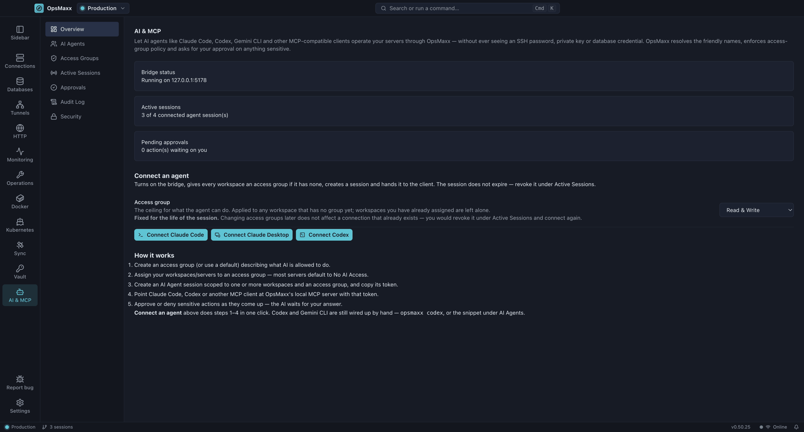

# AI agent access

How Claude Code, Claude Desktop, Codex and other MCP clients reach your infrastructure through OpsMaxx without ever seeing a credential.

[← Back to the README](../README.md)

---


Claude Code, Claude Desktop, Codex, Gemini CLI and anything else that speaks
[MCP](https://modelcontextprotocol.io) can list your servers, run commands, browse/edit files and
check metrics through OpsMaxx. The agent asks for a server by its friendly name; OpsMaxx
resolves the real connection, enforces per-capability policy, and can stop and ask you before
anything sensitive runs.

Cloud servers — Google Cloud, AWS and Azure — are addressable the same way, under the same
permissions. They are the one kind of server where serving an agent means running a program on *your*
computer rather than only on a remote host, because that is what reaching them requires. What
bounds that, and how to opt out of it, is in
[AI-SECURITY.md](AI-SECURITY.md#cloud-servers-where-an-agents-input-does-reach-an-argv).


**An AI agent connected through OpsMaxx never receives:**

- SSH passwords
- SSH private keys or passphrases
- Database passwords or connection-string credentials
- Vault secrets — there is no MCP tool that can read the Vault at all
- Sudo or root access — unrestricted shells (`sudo -i`, `su`, ...) are refused on every profile but one: a session you have put on Bypass (see [Permission profiles](AI-MCP.md#permission-profiles))

It only ever gets a friendly server name, whatever a capability's ALLOW/ASK/DENY setting permits,
and redacted text output. See [AI-SECURITY.md](AI-SECURITY.md) for the full threat model —
including what this design does **not** claim.



### One choice: the profile

Each session gets one **profile**, and only you can set it, in the OpsMaxx window:

| Profile | What the agent can do |
|---|---|
| **Read only** | Look around, never change anything |
| **Ask first** | Every read runs; you approve every change before it runs |
| **Auto** | Routine work runs; sudo and risky actions — destructive commands, database writes, tunnels, server changes, VPN starts, CI runs — ask |
| **Bypass permissions** | Nothing asks and nothing is refused, except on Protected targets. Audited as such |
| **Custom** | An access group you pick, exactly as written |

The first four need no setup. None of them short of Bypass reads `/etc/shadow`, SSH keys or shell
history. Every `execute_command` counts as a change, so on Read only the agent uses `read_file`,
`list_files` and the other read tools instead.

**Custom** is for a policy the four do not express. An **access group** is a per-capability
ALLOW/ASK/DENY policy with file-path rules on top. Five ship with OpsMaxx: **Read Only**,
**Commands, no writes**, **Read & Write**, **Sudo Access** and **Full Access**, and you can create
your own:

<p align="center">


</p>

Two settings hold whatever the profile:

- **Protected.** Mark a workspace or server Protected and every change there is asked for — Auto,
  Custom and Bypass included.
- **Restrictions.** Assign an access group to a workspace or server to hold it below what any
  session would otherwise get, or assign **No AI Access** to take it out of reach. A restriction
  narrows every profile except Bypass; No AI Access holds even there. A session's
  **Effective access** panel lists the restrictions in its reach, with a Remove button on each.

So to hold a production box against a Bypass session, mark it Protected or set it to No AI Access.
[Permission profiles](AI-MCP.md#permission-profiles) has the details, including exactly what Bypass
does not lift.

### A worked example

**You ask Claude Code:** *"Check my production Nginx server."*

1. Claude Code calls OpsMaxx's `list_servers` tool. It gets back friendly names for whatever
   the session's workspace(s) and profile can see — say, `Nginx Server Prod` — never a hostname,
   IP or username.
2. It calls `get_server_metrics` (or `execute_command` with something like `systemctl status
   nginx`) naming that server. OpsMaxx resolves `"Nginx Server Prod"` to the real server record,
   checks the session's profile and any restriction on that server, and — if the answer is ALLOW — looks up the actual
   SSH credential from your OS keychain and connects. If it's ASK, the request sits in
   **Approvals** until you decide.
3. The command runs over a normal SSH connection, the same one an interactive terminal session
   would use. Output is scanned for known secrets and secret-shaped patterns and redacted before
   it's returned.
4. Claude Code sees the result — CPU, memory, `systemctl` output, whatever was asked for — and
   reports back to you. It never saw the server's IP, its username, or the key that authenticated
   the connection. The whole exchange is in the **Audit Log**, alongside anything else OpsMaxx
   allowed, asked about, denied or failed:


### Connecting an agent

The quickest route is **AI & MCP → Overview → Connect an agent**. One click turns on the bridge,
creates a session on the profile you picked, and hands it to the client. It writes no workspace
assignment, so it never holds a later session below this one:

| Button | What it does |
|---|---|
| **Connect Claude Code** | Copies a ready `claude mcp add` command, token already in it — paste it in a terminal |
| **Connect Claude Desktop** | Writes the bridge entry into `claude_desktop_config.json`, merging with whatever is already there |
| **Connect Codex** | Writes a managed `[mcp_servers.opsmaxx]` block into `~/.codex/config.toml` |

Existing config files are backed up first, other MCP servers in them are left alone, and running a
button again replaces its own entry rather than adding a second one. A workspace you have already
assigned to an access group — including **No AI Access** — is never reassigned.

There is also a CLI, if you would rather not click:

| Command | What it does |
|---|---|
| `opsmaxx claude` | Registers OpsMaxx with Claude Code (`claude mcp add`) and launches it — a one-time pairing code appears in OpsMaxx instead of copying a token by hand |
| `opsmaxx codex` | Same, for Codex — writes a managed block into `~/.codex/config.toml` |
| `opsmaxx run -- <command>` | Same pairing flow for any other MCP-aware CLI, via `OPSMAXX_MCP_COMMAND`/`OPSMAXX_MCP_ARGS` |

> On macOS the `opsmaxx` command is not added to your `PATH` by the installer — only the Windows
> installer does that. Use the Connect buttons, or call the launcher inside the app bundle directly.

Every other client connects over **Streamable HTTP** with a URL and a bearer token that
OpsMaxx's own **Security** tab generates for you:


**Claude Desktop is the exception** — it cannot use that URL. See
[Connecting Claude Desktop](#connecting-claude-desktop) below.

### Adding a token manually

Not every client has a one-command launcher yet:


1. **AI & MCP → AI Agents → New AI agent session** — pick a workspace and a profile (and, for
   Custom, an access group), then **Create session**.
2. The token is shown **once**, next to a ready-made JSON block — click **Copy JSON config**, or
   copy the raw token if you'd rather write the entry yourself.
3. Paste it into the client's own MCP config file, under `mcpServers`.
4. Restart the client.

```json
{
  "mcpServers": {
    "opsmaxx": {
      "type": "http",
      "url": "http://127.0.0.1:<port>/mcp",
      "headers": { "Authorization": "Bearer <token>" }
    }
  }
}
```

**Claude Code** needs no file editing at all — one command registers the same thing:

```bash
claude mcp add -s user --transport http opsmaxx http://127.0.0.1:<port>/mcp --header "Authorization: Bearer <token>"
```

### Connecting Claude Desktop

Claude Desktop **does not read `url` or `headers`** from `claude_desktop_config.json`. Entries in
that file are launched as stdio subprocesses; Desktop's remote-server support is a separate
account-level Connectors feature with nowhere to put a bearer token for a `127.0.0.1` address.

OpsMaxx ships a stdio bridge for exactly this case — a pure protocol relay that forwards
messages to the same authenticated HTTP endpoint, so a stdio-only client gets the identical
policy, approval and audit path (`src/cli/bridge.ts`).

The short way is the npm package, which is the same relay without the absolute paths:

```json
{
  "mcpServers": {
    "opsmaxx": {
      "command": "npx",
      "args": ["-y", "@opsmaxx/mcp"],
      "env": { "OPSMAXX_MCP_TOKEN": "<token>", "OPSMAXX_MCP_PORT": "<port>" }
    }
  }
}
```

If you have run `opsmaxx claude` at least once, the `env` block can be dropped: the package
reads the session the CLI already cached. Source and detail:
[`@opsmaxx/mcp`](https://github.com/OpsMaxx/opsmaxx-mcp).

Or point Desktop straight at the bundled bridge, with no Node dependency at all:

```json
{
  "mcpServers": {
    "opsmaxx": {
      "command": "/Applications/OpsMaxx.app/Contents/MacOS/OpsMaxx",
      "args": [
        "/Applications/OpsMaxx.app/Contents/Resources/app.asar.unpacked/out/cli/index.js",
        "bridge", "--token", "<token>", "--port", "<port>"
      ],
      "env": { "ELECTRON_RUN_AS_NODE": "1" }
    }
  }
}
```

On **Windows**, the two paths become `%LOCALAPPDATA%\Programs\OpsMaxx\OpsMaxx.exe` and
`%LOCALAPPDATA%\Programs\OpsMaxx\resources\app.asar.unpacked\out\cli\index.js`.

The config file lives at `~/Library/Application Support/Claude/claude_desktop_config.json` on
macOS and `%APPDATA%\Claude\claude_desktop_config.json` on Windows. Restart Desktop afterwards.

`ELECTRON_RUN_AS_NODE` makes OpsMaxx's own bundled Electron binary run the bridge as plain
Node, so nothing has to be installed separately and none of this depends on what is on your
`PATH` — which Claude Desktop does not inherit from your shell.

> **Give the Desktop session no expiry.** Set **Expires** to *Never* when creating it. The
> default is 60 minutes, after which Desktop silently stops being able to reach OpsMaxx until
> you issue a new token.

The token is shown only once and stored only as a hash — if you lose it, revoke that session
under **Active Sessions** and create a new one rather than hunting for it:


**Full technical guide (architecture, sessions, Access Groups, pairing, troubleshooting):**
[docs/AI-MCP.md](AI-MCP.md). **Threat model:** [docs/AI-SECURITY.md](AI-SECURITY.md).

---

[← Back to the README](../README.md)
