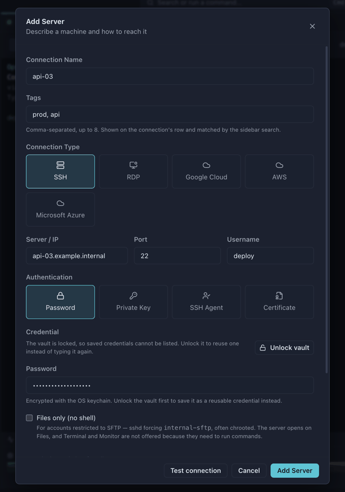
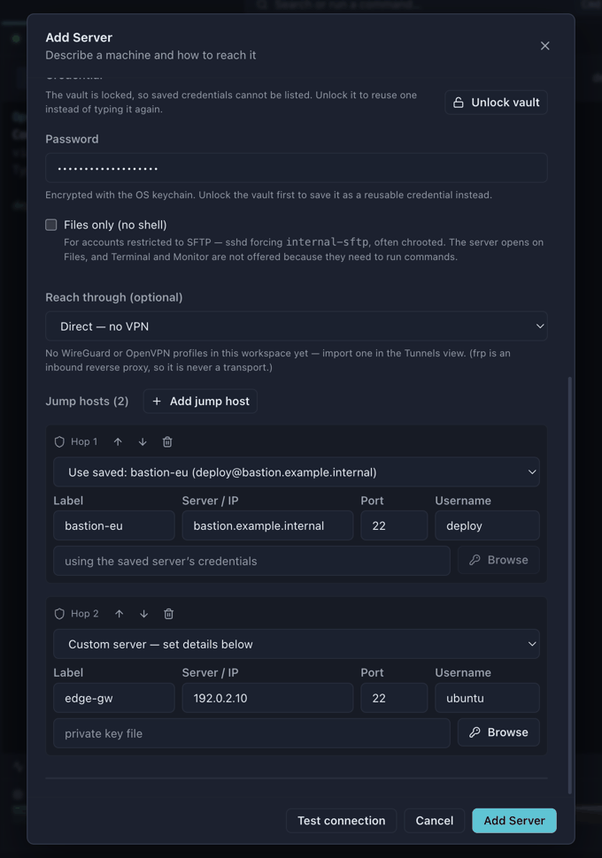

# Install

Every install route for Windows, macOS and Linux — and what to do about the first-run security warning.

[← Back to the README](../README.md)

---

## Install


Download the latest build from the [Releases](https://github.com/OpsMaxx/OpsMaxx/releases/latest) page.

| Platform | File | Notes |
|---|---|---|
| **Windows 10/11** | [`OpsMaxx-x.y.z-setup.exe`](https://github.com/OpsMaxx/OpsMaxx/releases/latest) | Installer, desktop + Start-menu shortcut. Pick this one if unsure. |
| **Windows (portable)** | [`OpsMaxx-x.y.z-portable.exe`](https://github.com/OpsMaxx/OpsMaxx/releases/latest) | Single file, no install, keeps its data beside the `.exe` — runs from a USB stick |
| **macOS (Apple Silicon)** | [`OpsMaxx-x.y.z-arm64.dmg`](https://github.com/OpsMaxx/OpsMaxx/releases/latest) | M1 and later |
| **macOS (Intel)** | [`OpsMaxx-x.y.z-x64.dmg`](https://github.com/OpsMaxx/OpsMaxx/releases/latest) | Intel Macs |
| **Linux** | [`OpsMaxx-x.y.z-x86_64.AppImage`](https://github.com/OpsMaxx/OpsMaxx/releases/latest) | `chmod +x OpsMaxx-*.AppImage` and run — works on any distribution |
| **Linux (Debian / Ubuntu)** | [`OpsMaxx-x.y.z-amd64.deb`](https://github.com/OpsMaxx/OpsMaxx/releases/latest) | `sudo apt install ./OpsMaxx-*-amd64.deb` |

### Package managers

| | |
|---|---|
| **macOS** | `brew trust opsmaxx/tap` then `brew install --cask opsmaxx/tap/opsmaxx` |
| **Windows** | `winget install OpsMaxx.OpsMaxx` — [pending review](https://github.com/microsoft/winget-pkgs/pull/431465) |

Homebrew's main cask repository has a notability threshold OpsMaxx does not meet yet, so
the cask lives in [its own tap](https://github.com/OpsMaxx/homebrew-tap) for now. The
`brew trust` step is Homebrew refusing to load a third-party tap until you say you trust
it; the cask it guards is a few lines of metadata you can read first. Homebrew clears the
quarantine flag on install, so this route also sidesteps the first-run warning below.

<details>
<summary><b>What are the other files on the release page?</b></summary>

Six of the assets on a release are the downloads above. The rest are build
metadata or source archives, and you can ignore them.

| Asset | What it is | Do you need it? |
|---|---|---|
| `*.blockmap` | A map of the installer's content blocks, used to work out which parts of a file changed between two versions so an update can download only the difference. | **No** — it is only read by an updater, never by you. |
| **Source code** (zip / tar.gz) | A snapshot of the repository at the tagged commit, generated by GitHub. Not a build — it contains no application, just the source. | **No**, unless you intend to [build from source](#build-from-source). |

</details>

### First run: why Windows shows a warning

**macOS does not warn any more.** From 0.30.1 the macOS build is signed with an Apple
Developer ID and notarized by Apple, and the ticket is stapled into the app — so it opens
normally, offline included, with no right-click-Open workaround. You can check it
yourself:

```bash
spctl -a -vvv /Applications/OpsMaxx.app
```

`source=Notarized Developer ID` is the answer that matters.

**Windows still warns**, because that build carries no signature at all. A Windows
code-signing certificate costs around **$200–$400 a year** from a certificate authority,
and this project is free and MIT licensed with no income behind it. Every unsigned app
gets the same treatment, whoever wrote it.

**The warning does not mean the file is unsafe.** It means the operating system cannot
confirm *who* published it. You can confirm that yourself — see
[Verifying a download](#verifying-a-download) below, and the entire source is public.

<details>
<summary><b>Windows — "Windows protected your PC"</b></summary>

SmartScreen shows a blue dialog saying *"Windows protected your PC"* and the **Run**
button is hidden.

1. Click **More info**
2. Click **Run anyway**

You may also see a "publisher unknown" prompt from User Account Control — that is the
same missing-certificate cause. This happens on the first run only.

</details>

<details>
<summary><b>macOS — "Apple could not verify OpsMaxx is free of malware"</b></summary>

Gatekeeper refuses to open the app, because the build has not been notarized — Apple has
not been asked to scan it, which requires the paid developer account above. The wording
varies a little between macOS versions; older ones say *"cannot be opened because the
developer cannot be verified"*.

- **macOS 15 Sequoia and later** — open **System Settings → Privacy & Security**, scroll
  down to the message naming OpsMaxx, and click **Open Anyway**. Sequoia removed the
  older right-click shortcut, so this is the only way through in the interface.
- **macOS 14 and earlier** — **right-click** (or Control-click) the app → **Open** →
  **Open** in the dialog.

Either way this is the first launch only; afterwards the app opens normally.

If you would rather do it from the Terminal, this clears the quarantine flag macOS attaches
to anything downloaded through a browser:

```bash
/usr/bin/xattr -cr /Applications/OpsMaxx.app
```

The `/usr/bin/` prefix is deliberate. If you have installed `xattr` through Homebrew or
`pip`, that copy comes earlier on your `PATH` and does not accept `-r` — it prints a usage
message and clears nothing, which looks exactly like the command having failed to help.

</details>

<details>
<summary><b>macOS — "OpsMaxx is damaged and can't be opened" (releases 0.2.2 and earlier)</b></summary>


**The download is not damaged, and this is fixed in releases after 0.2.2.** Builds up to and
including 0.2.2 left the macOS app unsigned, which meant the bundle still carried the
signature Electron itself ships with — a signature covering none of OpsMaxx's own files.
Gatekeeper reads that mismatch as a corrupted download and words it this way instead of the
ordinary "could not verify" message above. Unhelpfully, this particular dialog offers no
**Open Anyway** button, so there is nothing to click through.

If you want to satisfy yourself the file arrived intact before doing anything else, check the
release's SHA-256 against your download — see [Verifying a download](#verifying-a-download).

Do **not** move it to the Trash. Run this once instead:

```bash
/usr/bin/xattr -cr /Applications/OpsMaxx.app
```

Then open the app normally. If it still refuses:

- Check the path is right — drag the app into the Terminal window after typing
  `/usr/bin/xattr -cr ` rather than typing it out.
- Make sure you are pointing at the copy in `/Applications`, not the one still sitting in
  `~/Downloads`.
- Keep the `/usr/bin/` prefix. A Homebrew or `pip` `xattr` earlier on your `PATH` does not
  support `-r` and will quietly do nothing but print its usage text.

Newer releases are ad-hoc signed, which puts them back into the ordinary "could not verify"
category above — still a warning, but one with a button.

</details>

<details>
<summary><b>Linux — no warning</b></summary>

Linux does not gatekeep unsigned binaries, so there is nothing to bypass. Just make the
AppImage executable:

```bash
chmod +x OpsMaxx-*.AppImage
```

</details>

> **Will Windows be fixed too?** Not yet. macOS was done in 0.30.1 — an Apple Developer
> account is $99 a year, which was affordable; a Windows certificate is $200–$400 a year
> and is not, for now. Until then the SHA-256 checksums on each release are the way to
> verify that what you downloaded is what was built.

### Antivirus scan

Every release is scanned automatically as part of the build, by three independent
scanners, before anything is published:

| Scanner | What it is | Runs on |
|---|---|---|
| **Microsoft Defender** | The engine that ships with Windows — the same one that will scan the installer on your own machine | The Windows build runner, on the `.exe` files it just produced |
| **ClamAV** | The open-source engine, with signatures refreshed at build time | The Linux release job, across every artifact |
| **[VirusTotal](https://www.virustotal.com)** | Aggregates **70+ commercial engines** in one report | The release job, with a per-file report linked in the notes |

A detection from Defender or ClamAV **fails the build**, so a release that exists at all
has passed both. The results — and the VirusTotal links for each file — are printed in
every release's notes.

If you would rather check for yourself rather than trust a link in a README, you can:

- **Look the file up by its hash.** Every release lists a SHA-256 per asset. Paste it
  into [virustotal.com](https://www.virustotal.com) — searching by hash proves the report
  belongs to the exact bytes you downloaded, which a link alone does not.
- **Upload the file** to VirusTotal yourself.
- **Build from source.** The entire application is in this repository; see
  [Build from source](#build-from-source).

> **A note on false positives.** Unsigned Electron applications are flagged by one or two
> minor engines fairly often — an installer that unpacks an executable and opens network
> connections is, structurally, what a lot of malware also does. A handful of detections
> from engines you have never heard of, against a clean result from the major ones, is the
> normal picture for an unsigned open-source desktop app. Code signing is what removes it,
> and that is a cost problem rather than a technical one.

### Verifying a download

Every asset on the release page lists its SHA-256. Compare it against the file
you downloaded — the builds are unsigned, so this is the strongest integrity
check available:

```bash
sha256sum OpsMaxx-x.y.z-x86_64.AppImage    # Linux
shasum -a 256 OpsMaxx-x.y.z-arm64.dmg      # macOS
```

```powershell
Get-FileHash OpsMaxx-x.y.z-setup.exe -Algorithm SHA256    # Windows
```

### Build from source

```bash
git clone https://github.com/OpsMaxx/OpsMaxx.git
cd OpsMaxx
npm install

npm run dev          # run in development
npm run typecheck    # type check main, preload and renderer
npm run build        # bundle without packaging

npm run dist:win     # Windows installer + portable exe
npm run dist:linux   # AppImage + deb
npm run dist:mac     # dmg (must be run on macOS)
```

Requires **Node.js 20+**. Build each platform's installer on that platform.

## Quick start


### 1. Add a server

Click **+** in the Connections sidebar, or press <kbd>Ctrl</kbd>+<kbd>N</kbd>.



Fill in the server, port and username, then pick how to authenticate:

- **Password** — stored in your OS keychain
- **Private key** — browse to the key file; the path and optional passphrase are stored in the keychain, never in plaintext
- **SSH Agent** — uses `SSH_AUTH_SOCK`, or Pageant on Windows
- **Certificate** — for certificate-based setups

> **Key files without an extension** (`id_ed25519`, or any bare filename) are fully supported — the file picker shows all files by default.

### 2. Add jump hosts, in the same dialog

Servers inside a private network are reached through a bastion. Click **Add jump host** and the hops appear right there — no second dialog, no separate step.



Each hop can either:

- **Use a saved server** — the hop borrows that server's stored credentials, so a key is defined once and reused, or
- **Be a custom server** — set its own server, port, user and private key

Hops connect in order, top to bottom: `you → Hop 1 → Hop 2 → target`. Use the arrows to reorder.

### 3. Open a session

Click a server to open it. **Double-click to open an additional session** in a new tab — useful when you want one shell tailing logs and another running commands.

Sessions keep running when you switch workspaces, change views or open a database. Nothing is torn down until you close the tab.

---

[← Back to the README](../README.md)
