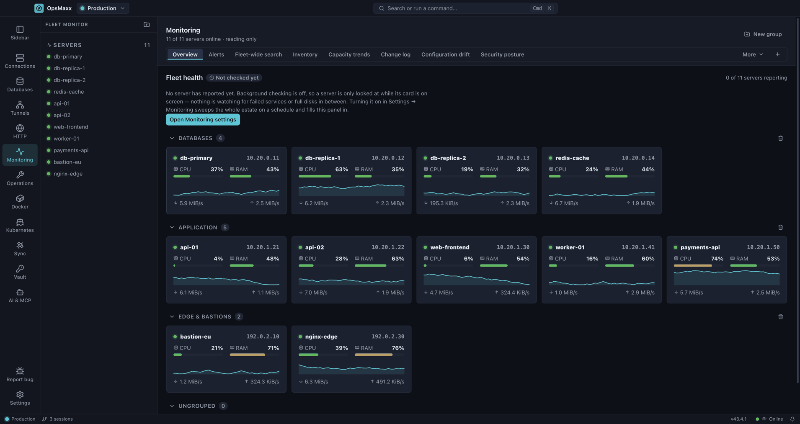

# Monitoring and fleet operations

Watching a fleet, and running the same change across it safely.

[← Back to the README](../README.md)

---

## Fleet Monitor

Press <kbd>Ctrl</kbd>+<kbd>M</kbd> for a live wall of every server in the workspace —
CPU, memory, disk and network for each, with the estate totalled across the top.

Cards are **grouped**, so databases, application servers and bastions stay visually
separate rather than becoming one long list. Drag a card between groups, or create a
group from the button in the top right; anything unplaced collects in **Ungrouped**, and
groups collapse when you want them out of the way.

The header totals what you actually have: servers reporting, vCPU across the fleet, and
RAM and disk as used-against-capacity. Every figure comes from metrics already being
sampled — for open sessions, and for the whole workspace if **Check servers in the
background** is on — so opening this view adds no extra SSH load. With neither, a server
you have not opened has nothing to show.

## Fleet operations

The same <kbd>Ctrl</kbd>+<kbd>M</kbd> view carries the work that is about the estate rather than
one server: inventory, patching, broadcast, log tailing, search, Docker, Compose, Kubernetes,
database operations, backups, posture, firewall rules, drift, capacity, rules, cron, runbooks,
the change log, access and keys.

Twelve of these are **modules**, in *Settings → Modules*, and all but one ship **off**. Nothing is
collected for a module you have not enabled, and one you never enable costs you nothing — no screen,
no SSH traffic, no rows in the store. That is what "we do not ship bloatware" had to mean in
practice rather than as a claim. The exception is *Scheduled jobs*, which is on by default because
reading a crontab changes nothing; editing one still goes through approval like any other write.

Three rules hold across all of them, and they are the reason this is not just a dashboard:

- **A number nobody measured is not zero.** A server that refused to answer says so, and never
  contributes a zero that quietly drags a fleet average down. The collectors that read server state
  answer in seven words rather than two — *ok*, *partial*, *absent*, *denied*, *no tool*,
  *unsupported*, *unknown* — because "the tool is not installed", "this account may not look" and
  "this server cannot answer at all" are three different facts, and only one of them is worth
  escalating.
- **Anything that writes goes through the same approval a human would need**, and is recorded in
  the change log with who approved it and what it did. A rule that fires a command does not get a
  quieter path than you typing it.
- **Work outlives the window.** A broadcast or a patch wave keeps running on the server if OpsMaxx
  is closed, and is picked back up by id when it reopens — reported honestly as *abandoned* or
  *orphaned* when nobody can say how it ended, rather than guessed at.

---

[← Back to the README](../README.md)
