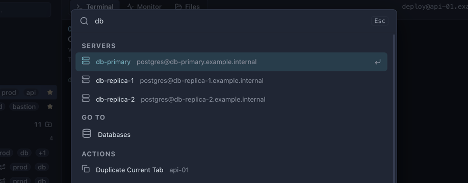

# Terminal

The terminal, the shell on this machine, the command palette and every keyboard shortcut.

[← Back to the README](../README.md)

---

## Terminal

| Action | Shortcut |
|---|---|
| Search the scrollback | <kbd>Ctrl</kbd>+<kbd>F</kbd> |
| Zoom in / out / reset | <kbd>Ctrl</kbd>+<kbd>+</kbd> / <kbd>Ctrl</kbd>+<kbd>-</kbd> / <kbd>Ctrl</kbd>+<kbd>0</kbd>, or <kbd>Ctrl</kbd>+scroll |
| Copy selection | Select (copy-on-select), or <kbd>Ctrl</kbd>+<kbd>Shift</kbd>+<kbd>C</kbd> |
| Paste | Right-click, or <kbd>Ctrl</kbd>+<kbd>Shift</kbd>+<kbd>V</kbd> |
| New session for this server | Double-click the server |
| Next / previous tab | <kbd>Ctrl</kbd>+<kbd>Tab</kbd> / <kbd>Ctrl</kbd>+<kbd>Shift</kbd>+<kbd>Tab</kbd> |
| Close tab | <kbd>Ctrl</kbd>+<kbd>W</kbd> |
| Command palette | <kbd>Ctrl</kbd>+<kbd>K</kbd> |

**Open files in your own editor.** In the Files view, right-click a remote file
and choose **Open in code** to edit it in VS Code (or whatever you configure in
Settings → Editor). Saving uploads it back to the server automatically — no
download/re-upload dance. The inline editor is still there for quick edits.

**Multi-line pastes ask first.** Pasting more than one line into a remote shell
shows a preview and a confirmation, because every line runs the moment it
lands. Single-line pastes go straight through.

Control keys such as <kbd>Ctrl</kbd>+<kbd>C</kbd>, <kbd>Ctrl</kbd>+<kbd>A</kbd> and <kbd>Ctrl</kbd>+<kbd>W</kbd> pass through to the remote shell, so `vim`, `nano` and bash line editing behave normally.

**Monitoring** is docked under the terminal rather than hidden in a separate tab. Expand it for live CPU, memory, disk and network. The strip samples only the tab you are looking at, and shares that session's SSH connection. Watching the servers you are *not* looking at is a separate feature — see [Checking servers in the background](#checking-servers-in-the-background).

### Alerts

When a server's CPU or memory reaches **80%** (configurable) you get a native OS
notification, repeated once a minute while it lasts and cleared automatically on
recovery. A count also appears in the status bar. A **systemd unit that has
failed** raises one too, on the transition into failure rather than every check,
so a service that has been down for a week does not re-announce itself.

A **root filesystem more than 85% full** raises one as well — the same 85% at
which the Fleet Monitor lists the server as needing attention and turns its disk
bar red, so the alert and the screen it sends you to can never disagree. The
status-bar count is that same figure and nothing else: clean a disk from 90% to
82% and the chip goes as soon as the next sample lands, because the Fleet
Monitor has stopped listing the server. It repeats **every six hours**, not every
minute: a disk does not empty itself, and a minute-long window is roughly ten
thousand notifications a week for one server that nobody can fix before Monday. It
does speak up sooner if the disk gets **5 percentage points worse** than the
figure it last reported, and again immediately if a disk that had recovered
fills a second time. Only `/` is measured — the probe is `df -kP /` and nothing
else, so a full `/var` on its own partition raises nothing here.

**Recovery has a margin, for CPU and memory only.** They clear five points below
the threshold rather than at it, so a server hovering on the line does not flicker
between alerting and clear on every two-second sample. Disk has no such gap: it
clears at 85% or below, the moment the Fleet Monitor stops flagging it.

**Turning alerts on or off.** Go to **Settings → Monitoring** and use the
**Alerts** toggle. It is the master switch: it is **on by default**, and
switching it off stops every CPU, memory, disk and failed-unit notification for
every server — and, because webhooks are sent from inside an alert, all webhook
delivery with them. **Switching it off also removes the alerts already showing**
in the status bar, and forgets the repeat windows behind them: a chip cannot
outlive the feature that raised it, and switching back on starts a clean slate
rather than resuming a six-hour disk window that began before the toggle. The
setting is global — it applies to all servers, not one at a time — and it persists
across restarts.

Under it, **Alert threshold** sets how hard a server has to be working before it
counts as high: **70%**, **80%** (default), **90%** or **95%**. The same
threshold applies to both CPU and RAM. Raise it if busy-but-healthy servers are
noisy, lower it if you want earlier warning. The threshold buttons are greyed
out while alerts are switched off. **Disk is not configurable**: it alerts above
**85%**, because that number is also what colours the bar and fills the Fleet
Monitor's attention list, and a slider that could pull one away from the other
would be a way to make the app contradict itself.

The last toggle in the section, **Show monitor under the terminal**, is
independent: it controls the live CPU/memory/disk/network strip docked below the
session, not whether you get alerted.

They are designed not to interrupt you:
- Notifications are handled by the operating system, so they render **outside
  the window and never cover the terminal**
- The status-bar chip sits in the layout, not floating over your output
- Nothing steals focus, and nothing must be dismissed before you carry on
- With the monitor open, alerts are evaluated from metrics **already being
  sampled**, so they add no extra SSH load. Background checking, below, is the
  part that costs something — that is the point of it being a separate switch

### Checking servers in the background

An alert is only worth having if it can reach you when you are not already
looking at the problem. **Settings → Monitoring → Check servers in the
background** samples **every server in the workspace** on a schedule, whether or
not a monitor is open, so a server that runs hot or a unit that dies at 3am is
noticed rather than discovered later.

It is off by default, because it is not free: each pass opens **one SSH exec
channel per server**, separately from the monitor strip's sampling. **How often**
sets the gap — **1**, **2** (default), **5** or **15 minutes** — measured from
the end of one pass to the start of the next, so a slow estate slows the cadence
instead of stacking overlapping checks on top of each other.

It needs the **vault unlocked**, since it has to resolve a credential per server.
While the vault is locked, checking **pauses rather than failing** — retrying into
a locked vault would produce an error loop and an audit entry per attempt.

Because "switched on" and "actually running" are not the same thing, the setting
shows what the sampler is really doing, refreshed while the pane is open:

| Line | What it means |
|---|---|
| `Running · 12 servers · last pass 4s ago, took 8s` | Working. `took` is the number to watch: if a pass takes longer than your interval, the interval is not realistic for your estate |
| `Paused — the vault is locked.` | Nothing is being checked until you unlock it |
| `Nothing to check` | No server in this workspace can be sampled |
| `Switched on, but nothing is scheduled` | The loop has stopped. Toggle it off and on to restart it |

### Webhook alerts

Alerts can also be **POSTed to an HTTPS endpoint** — Slack, Discord, Teams and
most alerting systems accept an incoming webhook, so one generic JSON message
covers them all. Set it up in **Settings → Monitoring → Send alerts to a
webhook**.

**What is sent is deliberately narrow.** Only the server's **friendly name** —
the one you chose — plus what fired, when, and the value against the threshold.
Never a server, an IP, a username, a log line or command output. The payload is
rebuilt field by field from a whitelist rather than forwarded, so nothing a
remote server says can travel through it to a third-party API.

**The URL is treated as a credential**, because it is one: anyone holding your
Slack webhook can post as you. It is **https only** (except to loopback), stored
with your other secrets via the OS keychain rather than in settings or backups,
and never read back into the app's UI — the settings screen knows only *that* one
is set. Redirects are not followed, so a `308` cannot quietly move your alerts to
an internal or cleartext server.

**Send test** posts one sample alert immediately, so a wrong URL is found while
you are looking at the settings rather than during an incident. It ignores the
switches on purpose — and says so, if a switch would have stopped the real thing.

**It depends on two other settings.** The **Alerts** master switch has to be on,
because every webhook is sent from inside an alert; and unless servers are
**checked in the background**, nothing is raised while you are elsewhere in the
app — so the webhook stays silent in exactly the situation you set it up for.

Under **Test delivery** the settings screen reports what the endpoint has
actually received: when the last alert was delivered, the last failure if there
was one, and how many alerts were **dropped**. Deliveries are capped at 30 a
minute as a backstop against a flapping unit, and anything over that is discarded
rather than queued — so the count is shown rather than hidden. An alerting path
that silently discards is worse than one that does not exist, because it is
trusted.

## Local terminal

A tab can also be a shell on **your own machine**, next to the SSH ones — same
terminal, same search, same copy-on-select, same scrollback. It is there so the
`ssh-keygen`, the `git push` and the `kubectl` you run between remote sessions do
not need a second application, and it runs as you, in your environment, exactly
as your usual terminal would.

OpsMaxx finds the shells rather than asking you to configure one:

| Platform | What appears in the list |
|---|---|
| **macOS** | Your login shell — from `$SHELL`, or from Directory Services when the app was started from Finder and `$SHELL` is unset — plus `/bin/zsh` and `/bin/bash` if they are not already it |
| **Linux** | Your login shell from `$SHELL` or the passwd entry, plus `bash`, `zsh` and `fish` where they exist |
| **Windows** | Command Prompt, Windows PowerShell 5.1, PowerShell 7, Git Bash, MSYS2 (UCRT64), and one entry per installed WSL distribution |

A shell that is not usable interactively is not offered — `dash` in particular,
where arrow keys print `^[[A` and there is no history. On Debian and Ubuntu
`/bin/sh` *is* dash, so the check follows the symlink rather than trusting the
name. On Windows every shell is found by absolute path and never by searching
`PATH`, because a writable directory earlier on `PATH` than System32 is a local
privilege escalation.

**On macOS the shell is a login shell, and that is not a preference.** A GUI
application is launched by launchd, whose `PATH` is the minimal
`/usr/bin:/bin:/usr/sbin:/sbin`. Everything a developer actually uses —
`/opt/homebrew/bin`, `/usr/local/bin`, whatever `/etc/paths.d` contributes — is
assembled by `path_helper`, which runs from `/etc/zprofile` and `/etc/profile`,
and those are read by a **login** shell only. Without `-l` you would get a
terminal where `brew`, `node` and `git` are simply not found, and it would look
like OpsMaxx had broken your machine. Terminal.app and iTerm2 start login
shells for the same reason. On Linux `bash` gets `-i` instead: a login bash reads
`~/.bash_profile` and deliberately skips `~/.bashrc`, which is where Linux users
keep their aliases and prompt, and the desktop session has already sourced
`~/.profile`, so there is no `PATH` problem to solve there.

**macOS re-asks for folder access after every update, and that is expected.** The
first time a command touches `~/Documents`, `~/Desktop`, `~/Downloads` or a
removable volume, macOS shows its Files-and-Folders prompt naming OpsMaxx and
saying it is for locally run commands. macOS records that grant against the app's
`cdhash`, and because OpsMaxx is [ad-hoc signed](install.md#first-run-why-your-computer-shows-a-warning)
rather than signed with a developer certificate, the `cdhash` changes with every
build. So **every release starts from no grants and prompts again**. It is not a
bug, and re-approving is the only way round it until the app is signed with a
stable identity. A denial is an ordinary permission error, not a crash.

**No AI agent can reach any of this.** The local terminal is deliberately absent
from the MCP bridge and the `opsmaxx` CLI — not gated behind a capability or
an approval, absent — and a test fails the build if that changes. See the *Local
terminal* section of [SECURITY.md](SECURITY.md) for why, and what a local shell
can read.

## Command palette

Press <kbd>Ctrl</kbd>+<kbd>K</kbd> anywhere — including with focus inside a
terminal — to search everything and jump straight to it, without reaching for
the mouse.

Start typing to filter across **every** category at once, then <kbd>Enter</kbd>
to run the highlighted entry.

| Group | What it does |
|---|---|
| **Actions** | Add Server, New Workspace, Import from `~/.ssh/config`, Open Fleet Monitor, Open Connections |
| **Settings** | Jump straight into Settings |
| **Workspaces** | Switch to any visible workspace by name |
| **Servers** | Open a terminal on any server in the current workspace — matches on name *and* on `user@host` |
| **Tunnels** | Jump to a tunnel, shown with its `listen → target` |

| Key | Action |
|---|---|
| <kbd>Ctrl</kbd>+<kbd>K</kbd> | Open the palette (also <kbd>Ctrl</kbd>+<kbd>Shift</kbd>+<kbd>P</kbd>) |
| <kbd>↑</kbd> / <kbd>↓</kbd> | Move through results |
| <kbd>Enter</kbd> | Run the highlighted entry |
| <kbd>Esc</kbd> | Close |

Because the search also matches the subtitle, typing part of a hostname or a
username finds the server even when you cannot remember what you named it —
`ubuntu@10.20` will find it just as well as `Production API`.

The palette works **while you are in a session**: hit <kbd>Ctrl</kbd>+<kbd>K</kbd>
mid-command, switch workspace or open another server, and the shell you left
keeps running exactly where it was.

## Keyboard shortcuts

On macOS use <kbd>Cmd</kbd> in place of <kbd>Ctrl</kbd>.

Every shortcut below is **rebindable** in Settings → Keyboard Shortcuts, and
each one is listed there with the context it applies to:

| Context | Meaning |
|---|---|
| **Everywhere** | Works with focus anywhere, terminals included |
| **Outside terminals** | Skipped while a terminal has focus, so the key reaches the remote shell |
| **In terminals** | Only fires with focus inside a terminal |

That split is why the palette and the sidebar each have two bindings. A shell
owns <kbd>Ctrl</kbd>+<kbd>K</kbd> (kill-line) and <kbd>Ctrl</kbd>+<kbd>B</kbd>
(backward-char, and the tmux prefix), so those stay out of terminals and a
Shift-qualified twin covers you there instead. The command box in the title bar
follows your focus: it shows <kbd>Ctrl</kbd>+<kbd>K</kbd> normally and
<kbd>Ctrl</kbd>+<kbd>Shift</kbd>+<kbd>P</kbd> once you click into a terminal —
and it shows whatever you have rebound them to.

### General

| Shortcut | Action | Context |
|---|---|---|
| <kbd>Ctrl</kbd>+<kbd>K</kbd> | Command palette — search servers, workspaces, tunnels and actions | Outside terminals |
| <kbd>Ctrl</kbd>+<kbd>Shift</kbd>+<kbd>P</kbd> | Command palette | Everywhere |
| <kbd>Ctrl</kbd>+<kbd>B</kbd> | Show / hide the sidebar | Outside terminals |
| <kbd>Ctrl</kbd>+<kbd>Shift</kbd>+<kbd>B</kbd> | Show / hide the sidebar | Everywhere |
| <kbd>Ctrl</kbd>+<kbd>,</kbd> | Open Settings | Outside terminals |

### Tabs and sessions

| Shortcut | Action | Context |
|---|---|---|
| <kbd>Ctrl</kbd>+<kbd>N</kbd> | Add server | Outside terminals |
| <kbd>Ctrl</kbd>+<kbd>T</kbd> | New terminal on the current server | Outside terminals |
| <kbd>Ctrl</kbd>+<kbd>Shift</kbd>+<kbd>D</kbd> | Duplicate the current tab | Outside terminals |
| <kbd>Ctrl</kbd>+<kbd>W</kbd> | Close the current tab | Outside terminals |
| <kbd>Ctrl</kbd>+<kbd>Tab</kbd> / <kbd>Ctrl</kbd>+<kbd>Shift</kbd>+<kbd>Tab</kbd> | Next / previous tab | Everywhere |
| <kbd>Ctrl</kbd>+<kbd>\</kbd> | Split right | Outside terminals |
| <kbd>Ctrl</kbd>+<kbd>Shift</kbd>+<kbd>\</kbd> | Split down | Outside terminals |
| Double-click a server | Open an additional session in a new tab | |

### Workspaces

| Shortcut | Action | Context |
|---|---|---|
| <kbd>Ctrl</kbd>+<kbd>1</kbd> … <kbd>9</kbd> | Switch to the Nth workspace | Everywhere |
| <kbd>Ctrl</kbd>+<kbd>Shift</kbd>+<kbd>N</kbd> | Manage workspaces | Everywhere |
| <kbd>Ctrl</kbd>+<kbd>L</kbd> | Lock the current workspace (password-protected ones only) | Outside terminals |

<kbd>Ctrl</kbd>+<kbd>1</kbd>…<kbd>9</kbd> is the one binding that cannot be
reassigned — the digit is the workspace number, not a key to map. Whether it
counts hidden workspaces is a setting.

### Views

| Shortcut | Action | Context |
|---|---|---|
| <kbd>Ctrl</kbd>+<kbd>Shift</kbd>+<kbd>E</kbd> | Open the Files view for the current tab | Everywhere |
| <kbd>Ctrl</kbd>+<kbd>M</kbd> | Open the Fleet Monitor | Outside terminals |
| <kbd>Ctrl</kbd>+<kbd>=</kbd> / <kbd>Ctrl</kbd>+<kbd>-</kbd> / <kbd>Ctrl</kbd>+<kbd>0</kbd> | Terminal font bigger / smaller / reset | Everywhere |
| <kbd>Ctrl</kbd>+scroll | Zoom in / out | In terminals |
| <kbd>F12</kbd> | Developer tools | |

### Terminal

| Shortcut | Action | Context |
|---|---|---|
| <kbd>Ctrl</kbd>+<kbd>Shift</kbd>+<kbd>C</kbd> or <kbd>Ctrl</kbd>+<kbd>Insert</kbd> | Copy selection | In terminals |
| <kbd>Ctrl</kbd>+<kbd>Shift</kbd>+<kbd>V</kbd> or <kbd>Shift</kbd>+<kbd>Insert</kbd> | Paste | In terminals |
| <kbd>Ctrl</kbd>+<kbd>Shift</kbd>+<kbd>F</kbd> or <kbd>Ctrl</kbd>+<kbd>F</kbd> | Search the scrollback | In terminals |
| <kbd>Enter</kbd> / <kbd>Shift</kbd>+<kbd>Enter</kbd> | Next / previous match while searching | |
| Right-click | Paste (PuTTY / MobaXterm style) | In terminals |
| Select text | Copies automatically | In terminals |

Text selection copies on release, and pasting more than one line asks for
confirmation first.

### Customising shortcuts

Settings → Keyboard Shortcuts.

- **Rebind** — click a shortcut and press the keys you want. The combo is
  recorded exactly as pressed.
- **Clear** — press <kbd>Backspace</kbd> while recording to leave a command with
  no key at all. <kbd>Esc</kbd> cancels without changing anything.
- **Restore one** — a ↺ button appears next to any shortcut you have changed.
- **Reset all** — the Reset button puts every shortcut back to its default.
- **Conflicts** — two commands sharing a combo are flagged, but only when their
  contexts actually overlap. A terminal binding and an outside-terminal binding
  can safely share keys, because they never see the same key press.
- **Export / Import** — writes a small `opsmaxx-shortcuts.json` holding only
  the shortcuts you changed, so it stays valid across upgrades. Importing
  replaces your current overrides.

Changes take effect immediately and are saved with the rest of your settings, so
they survive a restart.

### Deliberately not bound

| Key | Why |
|---|---|
| <kbd>Ctrl</kbd>+<kbd>R</kbd> | Reserved for the shell's reverse history search. OpsMaxx never reloads on it — a reload would destroy every open session. |
| <kbd>Ctrl</kbd>+<kbd>C</kbd>, <kbd>Ctrl</kbd>+<kbd>A</kbd>, <kbd>Ctrl</kbd>+<kbd>E</kbd>, <kbd>Ctrl</kbd>+<kbd>O</kbd> | Passed to the remote shell so `vim`, `nano` and bash line editing behave normally. |
| <kbd>F5</kbd> | Blocked — it would reload the window and close every terminal. |

Nothing stops you binding one of these yourself, but scoping it to
**Everywhere** will take it away from the remote shell.

---

[← Back to the README](../README.md)
