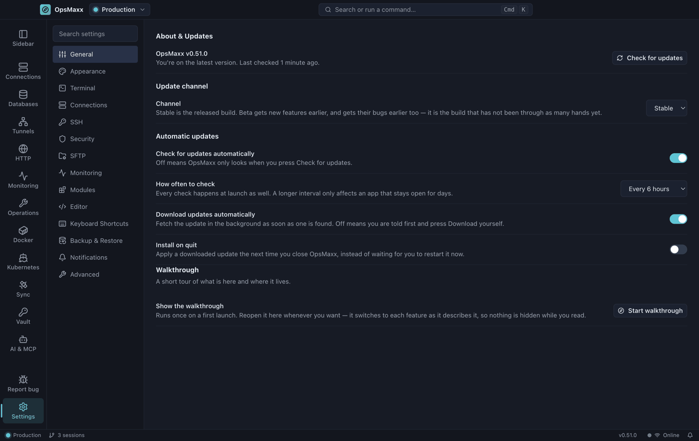

# Vault, backup and settings

The encrypted secrets vault, what a backup contains, and the settings worth knowing about.

[← Back to the README](../README.md)

---

## Vault

An encrypted store for the credentials that do not belong to a single server — cloud logins, API keys, database URLs, licence keys.

- **AES-256-GCM**, with the key derived from your master password using **scrypt**
- The master password is **never stored**; a wrong one fails the authentication tag
- Entries hold a URL, username, password, notes, tags and **any number of custom key/value fields**, each markable secret
- **Search matches every field**, so you can find an entry by hostname or username, not just its title

> There is **no recovery** if the master password is lost. That is the point.

### Secured, and locked

The vault has two shut states, and the difference is what stops.

**Secured** is what fifteen minutes of not touching the vault gets you. The entries are
cleared from the screen and from the app's window, and you need your master password to
look at them again. **Nothing else stops**: your connections, background checks, pipeline
polling and scheduled backups go on using the credentials in it. The timer measures *you*
— a monitoring sweep reading a credential is not you using your vault, and does not
postpone it.

**Locked** is the full stop — the key is gone from memory and nothing can resolve a
credential until you unlock it. That happens when you quit, when you press **Lock now**,
and when your machine **sleeps**. Locking the screen secures the vault rather than
locking it, because a screensaver is you stepping away, not the machine going off.

This split is deliberate and the reasoning is in [SECURITY.md](../SECURITY.md): the
thing an idle timer can actually protect is the decrypted entries in the window, and
stopping a monitoring tool from monitoring bought nothing for that.

## Backup & restore

Settings → **Backup & Restore** exports everything — workspaces, servers, databases, tunnels, stored credentials, the vault, workspace passwords and trusted host keys — into a **single passphrase-encrypted file**.

Credentials on disk are sealed with your OS keychain, which is tied to that machine and user, so a copied config folder is useless elsewhere. The backup unseals them and re-encrypts everything under your passphrase, which makes it **portable to any machine**.

A red **Backup out of date** indicator appears whenever your connections change, so you know when the last export no longer reflects reality.

## Settings

| Section | What it covers |
|---|---|
| **General** | Workspace-level preferences |
| **Appearance** | Theme (dark / light / system) and density |
| **Terminal** | Font family, **font size** (also <kbd>Ctrl</kbd>+<kbd>+</kbd>/<kbd>-</kbd>), cursor blink, scroll behaviour |
| **Connections** | Defaults for new connections |
| **SSH** | **How long an authenticated connection is kept** after its last session closes, and a live list of shared connections with a Disconnect button |
| **Security** | Credential storage, **how long the vault stays on screen**, workspace locking, and the list of **trusted SSH host keys** with a Forget button |
| **SFTP** | File transfer preferences |
| **Monitoring** | **Alerts** (on by default — the master switch for CPU, memory, failed units and webhooks), the threshold, **checking servers in the background** and how often, **webhook delivery**, and the monitor strip |
| **Modules** | The optional fleet modules, one switch each — eight of the twenty-one are on for a fresh install and everything that writes is off. See [Monitoring and fleet operations](monitoring.md) |
| **Editor** | Built-in file editor |
| **Keyboard Shortcuts** | **Rebind any shortcut**, clear it, reset to defaults, export/import, and whether <kbd>Ctrl</kbd>+<kbd>1</kbd>…<kbd>9</kbd> includes hidden workspaces |
| **Backup & Restore** | Encrypted export and import |
| **Notifications** | Alerts and toasts |
| **Advanced** | Diagnostics and resets |

The **SSH → Keep authenticated connection** setting is the one to know if your servers use two-factor auth: while a connection is alive, new sessions, file browsing and monitoring all reuse it, so you are asked for a code once rather than every time.

---

[← Back to the README](../README.md)
