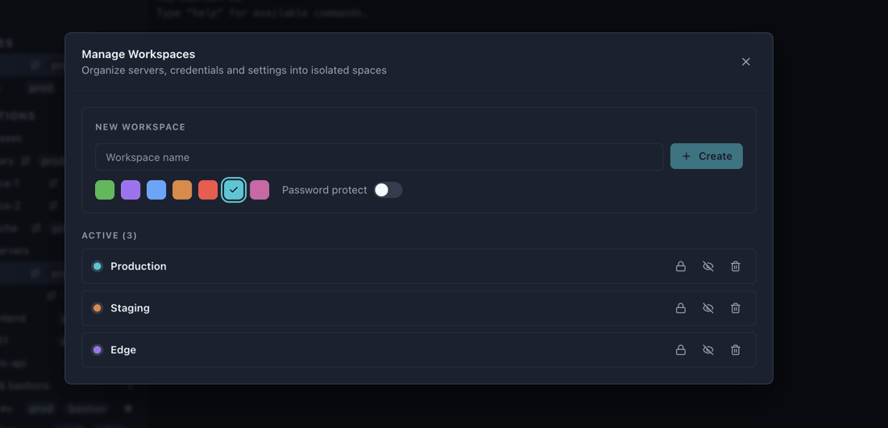
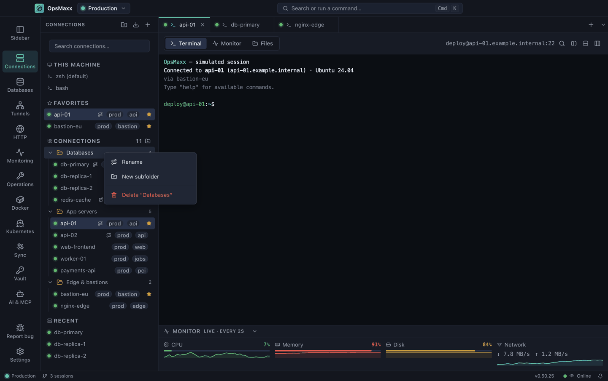

# Workspaces

Keeping clients, environments and projects apart — and the lock that makes that a boundary rather than a filter.

[← Back to the README](../README.md)

---

## Workspaces

A workspace is an isolated space with its own servers, folders, databases, tunnels and colour. Use one per client, per environment, or per project — whatever keeps unrelated infrastructure apart.

Open the switcher in the title bar, or **Manage Workspaces** (<kbd>Ctrl</kbd>+<kbd>Shift</kbd>+<kbd>N</kbd>).

**What a workspace gives you**

- **Isolation** — the sidebar, tabs and databases only ever show the active workspace
- **Colour coding** — pick a colour so production never looks like staging
- **Fast switching** — <kbd>Ctrl</kbd>+<kbd>1</kbd> … <kbd>Ctrl</kbd>+<kbd>9</kbd> jump straight to a workspace
- **Hiding** — clutter you rarely touch can be hidden from the switcher
- **Password protection** — lock a workspace behind a password
- **Live sessions survive** — switching workspaces never disconnects a running session

**Password-protected workspaces**

Toggle **Password protect** when creating a workspace, or use the padlock on an existing one. Anything that tries to open it — the switcher, the shortcut, the manager — asks for the password first. Unlocks last for the session only; everything re-locks when the app restarts. The password is stored as a scrypt verifier, never as recoverable text.

> **Scope of this feature:** a workspace password gates access **inside the app**. It does not encrypt the workspace's servers on disk. For data that must be protected at rest, use the [Vault](vault.md) or an [encrypted backup](vault.md).

## Organising servers with folders

Folders keep a long server list navigable, and they nest as deep as you like.

### Create a folder

The Connections toolbar has three actions — from left to right:

| Icon | Action |
|---|---|
| 📁+ | **New folder** — creates a folder and drops straight into rename |
| ⬇ | **Import from `~/.ssh/config`** — bulk-import your existing servers |
| ➕ | **Add server** |

There is also a small **New folder** button on the `CONNECTIONS` section header itself.

### Create a subfolder

**Right-click any folder** → **New subfolder**. The same menu has **Rename** and **Delete**.

Deleting a folder never deletes its contents — servers and subfolders move back to the top level.

### Move servers into folders

**Drag and drop.** Drag a server onto a folder to move it in; drag it onto the `CONNECTIONS` header to move it back to the root. Folders show a running count of everything inside them, including subfolders.

Databases have their own, separate folder tree with the same behaviour, so a "Staging" folder for servers does not clutter the database sidebar.

### Import from `~/.ssh/config`

Click the import icon to read your existing SSH config. OpsMaxx parses `Host`, `HostName`, `User`, `Port`, `IdentityFile` and `ProxyJump`, applies `Host *` wildcard defaults the way OpenSSH does, and shows a preview so you choose what to import. `ProxyJump` entries become jump hosts automatically, carrying the referenced server's key.

---

[← Back to the README](../README.md)
